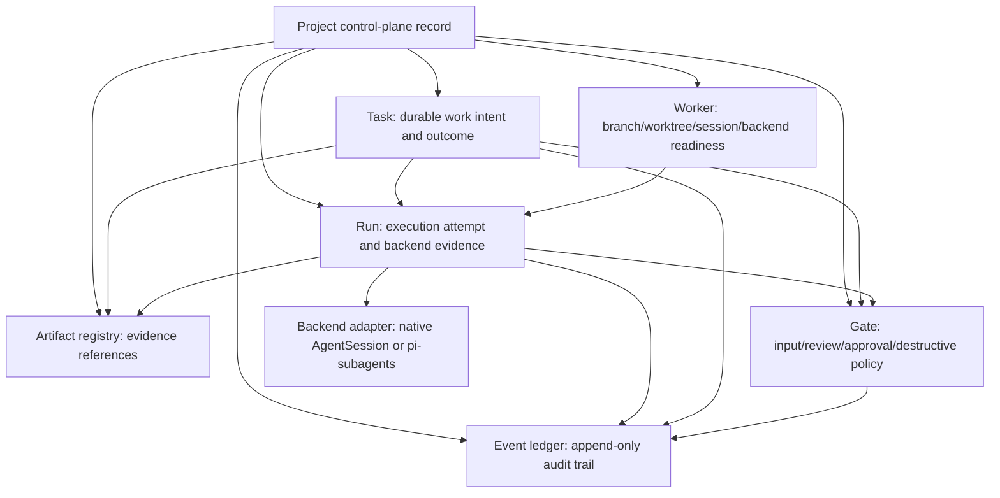
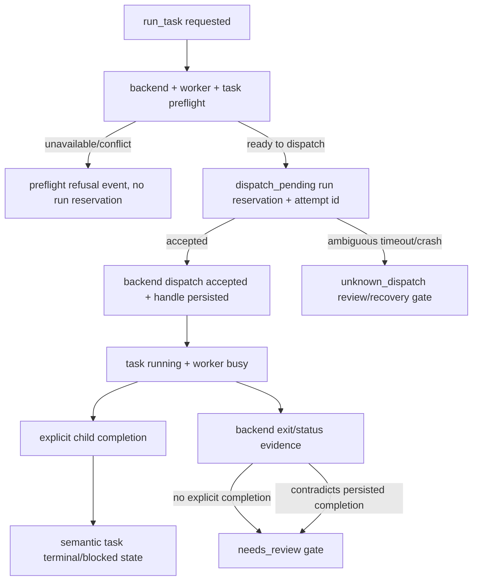
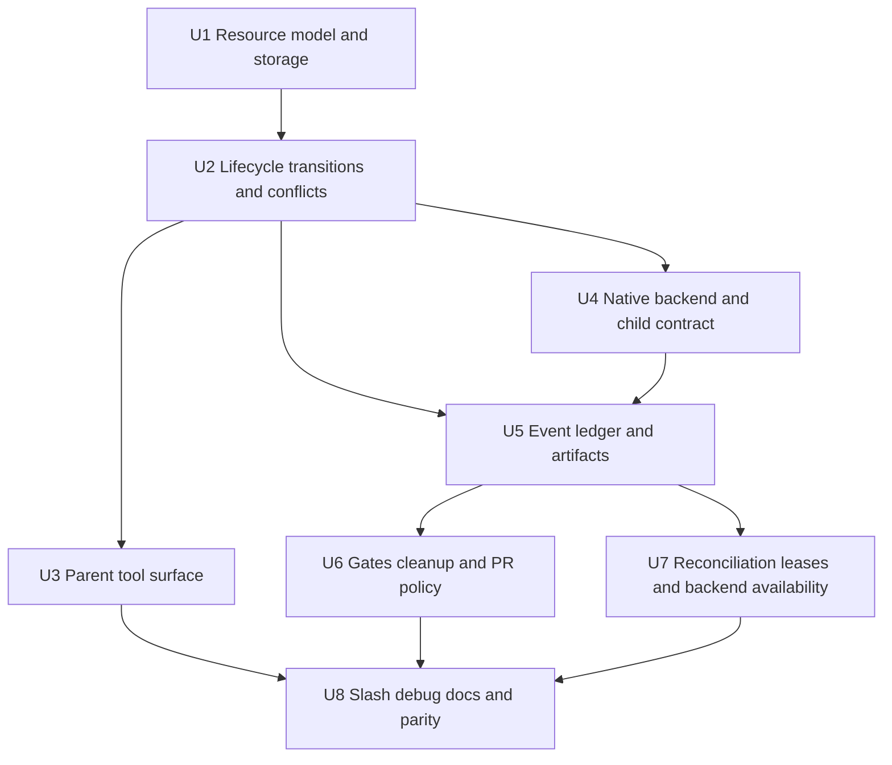

# feat: Rebuild pi-conductor as agent-native control plane

## Overview

Rebuild `packages/pi-conductor` from a worker-centric command helper into an agent-native durable control plane. The parent Pi agent should be able to create workers, create and assign durable tasks, start runs, observe events and artifacts, resolve gates, and reconcile drift through model-callable tools. Slash commands remain as a resource-shaped inspection/debug mirror rather than the primary orchestration surface.

The implementation intentionally replaces the current pre-0.x `WorkerRecord.currentTask` / `worker.lastRun` model with first-class `Worker`, `Task`, `Run`, `Artifact`, `Gate`, and `Event` resources. Existing command and persisted-state compatibility are not a design constraint, but developer-facing old-shape detection should fail clearly rather than opaquely.

***

## Problem Frame

`pi-conductor` already has durable project-scoped workers, isolated branches/worktrees, persisted Pi session references, recovery, summaries, PR prep, and a native foreground `AgentSession` run path. That foundation is useful but stores work intent and outcome on workers, so a parent agent cannot reason about durable tasks, run history, explicit child completion, approval gates, or stale/crashed execution from structured state.

The origin requirements define the next product step as a full local control-plane slice: conductor owns durable resource state, backends execute runs, child workers report progress/completion explicitly, and humans supervise through gates (see origin: `docs/brainstorms/2026-04-24-pi-conductor-agent-native-control-plane-requirements.md`). The related draft PRD `docs/prd/PRD-006-pi-conductor-agent-native-control-plane.md` already expands this into functional requirements and resolved planning decisions; this plan sequences the implementation.

***

## Requirements Trace

* R1. Expose workers, tasks, runs, artifacts, and gates as first-class durable resources.

* R2. Make model-callable tools the primary orchestration surface; `/conductor` is inspection/debug parity.

* R3. Replace existing pre-adoption worker-centric commands/state shapes rather than preserving aliases.

* R4. Separate worker readiness/health from task intent/progress/outcome.

* R5. Give tasks stable IDs, names/titles, prompts, lifecycle state, assignment, timestamps, runs, and artifacts.

* R6. Give runs stable IDs, task/worker/backend linkage, timestamps, terminal status, blockers/errors, session references, and artifacts.

* R7. Let parent Pi create, assign, run, and inspect tasks without human command choreography.

* R8. Centralize task/run/worker mutations so resource state cannot silently contradict itself.

* R8a. Persist any external backend dispatch through a crash-safe reservation protocol: durable dispatch attempt ID before the external call, backend handle after acceptance, idempotent retries, and `unknown_dispatch` recovery for ambiguous outcomes.

* R9. Give child workers an explicit task contract with task ID, goal, constraints, completion signal, and context.

* R10. Give child workers scoped tools for progress, artifacts, gates/blockers, follow-up tasks when allowed, and completion.

* R11. Do not treat backend process exit or final assistant text as semantic task completion by itself.

* R12. Define a backend abstraction for native Pi `AgentSession`, optional `pi-subagents`, and future backends.

* R13. Keep `pi-subagents` optional and adapter-based; conductor remains canonical state owner.

* R14. Persist `pi-subagents` backend run IDs, progress/completion events, artifacts, and availability diagnostics only through a documented or version-gated surface.

* R15. Persist append-only task/run events for transitions, progress, blockers, backend events, recovery, and completion.

* R16. Maintain an artifact/evidence registry for notes, test results, changed-file summaries, logs, completion reports, and PR evidence.

* R17. Provide concise current-state queries separately from detailed history queries.

* R18. Represent review/input/approval gates as durable resources resolvable by parent Pi or humans.

* R19. Bound autonomy with explicit contracts, completions, gates, and conservative policy for risky actions.

* R20. Attach PR prep to task/run/artifact evidence rather than only latest worker branch state.

* R21. Detect stale/crashed runs via leases, heartbeats, backend status, or equivalent durable signals.

* R22. Reconcile desired state and actual worktrees, sessions, runs, tasks, and backend jobs.

* R23. Preserve audit history during recovery and never invent success for interrupted or unknown work.

* R24. Provide an intent-level parent-agent delegation path for the common create/select worker -> create task -> assign -> run -> observe flow, so the documented happy path is not raw CRUD choreography.

* R25. Follow test-first development for feature-bearing units: write or update failing tests that capture the intended behavior before implementing the production change, with characterization coverage first where existing behavior is being replaced.

**Origin actors:** A1 parent Pi agent; A2 conductor worker; A3 child worker agent; A4 human user; A5 execution backend.

**Origin flows:** F1 agent-directed delegation; F2 worker task execution with explicit completion; F3 human review or approval gate; F4 reconciliation and recovery.

**Origin acceptance examples:** AE1 tool-only parent delegation; AE2 explicit child completion; AE3 optional `pi-subagents` backend adapter; AE4 approval gate before risky PR publication; AE5 stale/crashed run reconciliation without invented completion.

***

## Scope Boundaries

### Deferred for later

* Sophisticated automatic scheduling, priorities, dependency optimization, or resource quotas beyond the minimal control-plane needs.

* Full multi-worker plan DAG execution if it requires graph scheduling beyond basic task/run/gate resources.

* Worker-to-worker freeform messaging beyond structured task events, blockers, gates, and artifacts.

* Autonomous merge or automatic PR publication policies.

* Rich TUI/dashboard views beyond enough `/conductor get`/list visibility to debug the system.

### Outside this product's identity

* Replacing `pi-subagents` as a general-purpose subagent framework.

* Becoming a cloud workflow engine like Temporal/Inngest/Hatchet.

* Treating conductor as primarily a human CLI for manually operating agents.

* Preserving pre-0.x command compatibility at the cost of a cleaner agent-native model.

### Deferred to Follow-Up Work

* Advanced scheduling and DAG orchestration: separate PRD after the resource/event/gate model is proven.

* Rich dashboard/TUI: future consumer of the same resource APIs.

* SQLite or database-backed storage: only if JSON event volume or query needs exceed the local package model.

* Stable upstream `pi-subagents` public API work: coordinate separately if the current event/tool surface is not sufficient for actual dispatch.

***

## Context & Research

### Relevant Code and Patterns

* `packages/pi-conductor/extensions/types.ts` currently defines worker-centric state: `WorkerRecord`, `WorkerLifecycleState`, `WorkerLastRun`, `WorkerRuntimeState`, summary and PR metadata.

* `packages/pi-conductor/extensions/storage.ts` persists project state in conductor-owned local JSON under `PI_CONDUCTOR_HOME` or `~/.pi/agent/conductor/projects/<project-key>/run.json`; it already normalizes legacy worker fields on read.

* `packages/pi-conductor/extensions/conductor.ts` is the existing service/orchestration layer and should remain the only public mutation boundary for resource transitions.

* `packages/pi-conductor/extensions/runtime.ts` is the native Pi `AgentSession` seam. It already uses a minimal resource loader and default-deny tools for headless workers.

* `packages/pi-conductor/extensions/index.ts` registers model-callable tools with TypeBox schemas and text/details results.

* `packages/pi-conductor/extensions/commands.ts` and `packages/pi-conductor/extensions/status.ts` form the slash-command/debug rendering layer.

* `packages/pi-conductor/extensions/git-pr.ts`, `worktrees.ts`, `workers.ts`, `summaries.ts`, and `project-key.ts` are helper layers to adapt rather than fold into the core state model.

* Existing tests under `packages/pi-conductor/__tests__/` are already organized by these seams and should be updated rather than collapsed into large end-to-end tests.

* Pi extension documentation confirms `pi.registerTool`, `promptSnippet`, `promptGuidelines`, `prepareArguments`, `onUpdate`, dynamic tools, `pi.setActiveTools`, event bus, and concrete TypeBox schemas as the right surface for model-callable tools.

* Pi SDK documentation confirms that native child runs can use `createAgentSession`, `DefaultResourceLoader`, `customTools`, cwd-specific built-in tool factories, `SessionManager`, and event subscriptions. It also confirms custom tools can be passed directly to an `AgentSession`, which is the preferred proof path for scoped child reporting tools.

* `pi-subagents` documentation confirms the tool-oriented backend surface supports single, chain, parallel, async, status, interruption, artifacts, session logs, and control events, but also warns that attention signals are not lifecycle state. Conductor should treat it as execution evidence, not canonical task state.

### Institutional Learnings

* `docs/adr/ADR-0001-sdk-first-worker-runtime.md`: keep worker runtime SDK-first, not terminal/process scraping.

* `docs/adr/ADR-0002-conductor-project-scoped-storage.md`: conductor owns orchestration metadata outside the repo; Pi owns sessions and git owns repository state.

* `docs/adr/ADR-0003-continuity-based-worktree-reuse.md`: worktree reuse means continuity of a thread of work; ambiguous drift should surface as broken/recoverable, not silent reuse.

* `docs/adr/ADR-0006-agent-session-based-foreground-run-execution.md`: preserve Pi session lineage for native runs; map backend stop reasons explicitly but do not treat them as semantic task completion.

* `docs/adr/ADR-0007-single-worker-run-before-multi-worker-orchestration.md`: phase orchestration carefully; prove the run contract before adding scheduling complexity.

* `docs/adr/ADR-0011-conductor-run-extension-binding-and-preflight-policy.md`: use default-deny headless execution and deliberately inject only approved run-scoped tools.

* No `docs/solutions/` directory exists yet, so there are no prior compound-learning docs to carry forward.

### External References

* Pi extension docs: `pi.registerTool`, concrete TypeBox schemas, tool result shape, prompt metadata, `prepareArguments`, dynamic active tools, event hooks, and extension event bus.

* Pi SDK docs: `createAgentSession`, `DefaultResourceLoader`, `customTools`, cwd-specific built-in tool factories, `SessionManager`, session events, and SDK run modes.

* `pi-subagents` skill docs: subagent tool modes, async status/control, artifacts/session logs, attention signals, and best practices for narrow tasks and single-writer control.

***

## Key Technical Decisions

| Decision                                                                                                           | Rationale                                                                                                                                                                          |
| :----------------------------------------------------------------------------------------------------------------- | :--------------------------------------------------------------------------------------------------------------------------------------------------------------------------------- |
| Use a versioned project control-plane record in existing conductor storage                                         | Preserves ADR-0002 local ownership while allowing a clean schema replacement.                                                                                                      |
| Continue JSON storage for this slice, but add atomic write plus revision/lock semantics                            | Avoids database churn while preventing lost parent/child progress events.                                                                                                          |
| Treat `Task` and `Run` as the source of work state; `Worker` only owns execution environment readiness/health      | Satisfies R4 and prevents recreating `currentTask`/`lastRun` ambiguity.                                                                                                            |
| Centralize all mutations behind storage/conductor transition helpers                                               | Satisfies R8 and makes invariant tests possible.                                                                                                                                   |
| Implement a transition table and conservative conflict semantics before tool surface churn                         | Prevents contradictory active runs, duplicate completion, and ambiguous reruns.                                                                                                    |
| Prove native child-tool injection early through run-scoped custom tools or a conductor-aware child resource loader | Explicit completion is a core requirement; if the bridge is not proven, native runs must fall back to `needs_review`.                                                              |
| Separate parent orchestration tools from child run-scoped reporting tools                                          | Keeps child contexts default-deny and prevents accidental broad conductor self-management.                                                                                         |
| Treat backend status as runtime evidence, not semantic completion                                                  | A persisted explicit completion report is the preferred semantic source of truth; missing or contradictory evidence creates review gates.                                          |
| Make `pi-subagents` availability detection a first-class adapter behavior                                          | Native backend must remain baseline; unknown `pi-subagents` versions should report `backend_unavailable`, not corrupt state.                                                       |
| Make hard cleanup and PR publication gate-protected by default                                                     | Aligns with bounded autonomy and origin AE4.                                                                                                                                       |
| Treat the event ledger as part of state integrity, not later observability                                         | U1 must define event shape and append-with-mutation semantics; U5 can then add richer artifact/history rendering rather than retrofitting audit into lifecycle code.               |
| Use a two-phase run admission boundary                                                                             | Backend preflight/dispatch acceptance determines whether a run becomes active; unavailable backends should not create phantom running work.                                        |
| Make child reporting tools runtime-constructed capabilities, not globally registered parent tools                  | Hidden run scope, nonce/correlation binding, and actor metadata prevent child contexts from becoming confused deputies.                                                            |
| Define backend-neutral adapter semantics before native-specific details dominate                                   | Native `AgentSession` and optional `pi-subagents` should both map into conductor-owned runtime evidence, progress, artifact, heartbeat, and completion concepts.                   |
| Gate approvals are operation-scoped and non-ambient                                                                | Approval must bind operation type, resource refs, evidence/revision context, resolver, and single-use or expiry semantics so stale approvals cannot authorize later risky actions. |

***

## Open Questions

### Resolved During Planning

* Which requirements document is primary? Use `docs/brainstorms/2026-04-24-pi-conductor-agent-native-control-plane-requirements.md` as origin and `docs/prd/PRD-006-pi-conductor-agent-native-control-plane.md` as supporting product detail.

* Should old command/state compatibility be preserved? No; origin and PRD explicitly allow breaking pre-0.x compatibility.

* Should actual `pi-subagents` dispatch be mandatory for the first implementation? No; implement the adapter seam and availability/version gating first, enabling dispatch only when the surface is proven.

* Should backend exit without explicit completion mark a task completed? No; default to `needs_review` plus a review gate.

* Should reconciliation mutate aggressively by default? No; default to report plus safe state marking/events. Destructive filesystem/session repair requires explicit operation and gates when applicable.

### Deferred to Implementation

* Exact TypeScript type names and helper names: implementation detail after refactoring `types.ts` and `storage.ts`.

* Exact native child-tool bridge mechanism: prove with Pi SDK `customTools` or resource-loader injection before marking explicit native completion supported.

* Exact `pi-subagents` bridge surface: detect installed/loaded capability and version; only dispatch through a documented or tested adapter path.

***

## Execution Posture

This plan should be implemented test-first. Each feature-bearing unit should start by adding or updating the tests named in that unit so they fail for the missing behavior, then implement the smallest production change that satisfies them. Where the work replaces legacy worker-centric behavior, add characterization coverage for the current behavior or explicit removal expectation before changing code. Do not use broad end-to-end tests as a substitute for storage/lifecycle/runtime/tool invariant tests.

***

## High-Level Technical Design

> *This illustrates the intended approach and is directional guidance for review, not implementation specification. The implementing agent should treat it as context, not code to reproduce.*

### Resource relationship



### State ownership boundaries

| Resource | Owns                                                                                                                  | Does not own                                                   |
| :------- | :-------------------------------------------------------------------------------------------------------------------- | :------------------------------------------------------------- |
| Task     | Work intent, assignment, revision, semantic state, active run ref, run history, gates/artifacts refs                  | Backend process status or worker health                        |
| Run      | Execution attempt, task revision snapshot, backend evidence, lease generation, runtime status, completion report      | Durable task intent outside the captured revision              |
| Worker   | Execution environment identity, branch/worktree/session/backend readiness, health diagnostics                         | Semantic success/failure of work                               |
| Gate     | A bounded decision/input/approval request with scoped refs, resolver, revision/evidence context, and resolution state | Ambient permission to perform future unrelated actions         |
| Event    | Immutable audit fact for a committed mutation, refusal, conflict, or observation                                      | Large logs, secrets, full prompts, or full session transcripts |

Composite invariants are explicit: a running task has exactly one active nonterminal run; a busy worker corresponds to exactly one active run; terminal tasks have no active run; worker active pointers, if retained, are derived/index fields and never the authoritative source of work state.

### Run admission and completion precedence



Backend runtime status is recorded on the run as evidence. It can agree with, contradict, or be missing from semantic task completion; contradictions produce events and review gates rather than silent overwrites. Preflight failures before a dispatch attempt may append diagnostic events without creating a run reservation. Once conductor calls an external backend, it persists a `dispatch_pending` reservation with an idempotent dispatch attempt ID before the call, persists the backend handle after acceptance, and classifies crash/timeout ambiguity as `unknown_dispatch` rather than pretending the run never existed or successfully started.

### Security and authorization model

Parent tools, child reporting tools, human/debug slash commands, backend adapters, and external tools are separate trust zones. Parent/human tools may perform orchestration according to gate policy. Child tools are runtime-constructed capabilities bound to hidden run scope plus a nonce/correlation binding; model-visible task/run IDs are echoes, not authority. Backend adapter events are untrusted evidence until correlated to a conductor-created run and backend handle. Destructive filesystem/git/session actions and externally visible PR actions require scoped, current approval gates immediately before execution.

### Implementation-unit dependency graph



***

## Implementation Units

* [ ] U1. **Define control-plane resource model and safe storage**

**Goal:** Replace the worker-only persisted shape with a versioned project control-plane record containing workers, tasks, runs, gates, artifacts, events, schema version, monotonic revision, and old-shape detection.

**Requirements:** R1, R4, R5, R6, R8, R15, R16, R25; supports F1, F2, F4 and AE1.

**Dependencies:** None.

**Files:**

* Modify: `packages/pi-conductor/extensions/types.ts`

* Modify: `packages/pi-conductor/extensions/storage.ts`

* Modify: `packages/pi-conductor/extensions/workers.ts`

* Verify: `packages/pi-conductor/extensions/project-key.ts`

* Test: `packages/pi-conductor/__tests__/storage.test.ts`

* Test: `packages/pi-conductor/__tests__/workers.test.ts`

* Test: `packages/pi-conductor/__tests__/project-key.test.ts`

**Approach:**

* Introduce a project-level control-plane record that preserves existing project key/root/storage metadata but stores resource collections separately.

* Model `Worker` as execution environment identity/readiness/health: worker ID, stable unique name, branch, worktree, session/backend config, health diagnostics, and soft-deleted/archive state if needed. If worker-side active task/run refs are kept for query speed, treat them as derived/index fields updated only inside the same transition transaction as authoritative task/run state.

* Model `Task` as work intent/outcome: task ID, title, prompt/body, revision, assignment, state, active run, run history, latest progress, linked artifacts/gates, timestamps.

* Model `Run` as execution attempt: run ID, task ID, worker ID, task revision snapshot, backend type/handle, lease fields, lease generation/fencing token, runtime status, semantic completion report, terminal status, timestamps.

* Model the minimal `Event` shape in U1, not U5: stable event ID, monotonic sequence, project revision, actor, resource refs, event type, bounded payload, and timestamp. Event append is part of the core mutation contract.

* Model `Artifact` and `Gate` as appendable/queryable resources with stable IDs and resource refs; U5/U6 will add richer policy and rendering behavior.

* Define project-record invariants up front: monotonic revision/sequence, unique IDs, resolvable resource refs except intentionally archived/deleted historical refs, unique non-archived worker names, task titles not used as mutation identity, active-run consistency, terminal runs releasing workers, and task run history containing each run exactly once.

* Preserve the existing `readRun`/`writeRun` naming only if it remains clear; otherwise introduce storage helpers with clearer project-control-plane naming and keep old functions private or removed.

* Add schema-version detection with a matrix for missing state, empty file, corrupt JSON, old worker-only shape, partial new shape, unsupported future schema, and valid older minor schema. Unsupported worker-only state should be classified as legacy-incompatible unless a lossless migration is explicitly defined; do not overwrite it automatically.

* Add a canonical mutation envelope: read current record, validate schema, apply pure transition, validate full-record invariants, append required event(s), increment revision once, atomically persist, and surface typed conflicts when the transition is no longer valid.

* Use a per-project mutation lock as the required U1 concurrency mechanism, with owner metadata, acquisition timeout, stale-lock refusal/recovery behavior, and retries only inside the canonical mutation envelope. Atomicity should protect against torn/truncated JSON by writing a sibling temp file and renaming. The lock/retry protocol must ensure accepted concurrent mutations do not lose events or duplicate idempotent events.

**Execution note:** Start with characterization tests for current storage location/project-key behavior, then add failing tests for the new schema and old-shape detection before changing storage internals.

**Patterns to follow:**

* Existing normalization pattern in `packages/pi-conductor/extensions/storage.ts`.

* Existing worker ID/name/branch helpers in `packages/pi-conductor/extensions/workers.ts`.

* ADR-0002 conductor-owned project storage boundary.

* Pi extension guidance to keep tool output bounded; do not embed huge logs in state.

**Test scenarios:**

* Happy path: empty repo state -> creating a project record persists schema version, revision, empty resource collections, project key, and repo root.

* Happy path: creating worker and task resources persists stable IDs, timestamps, separate worker readiness/health, and task state without writing task outcome onto the worker.

* Happy path: appending an event through a mutation increments project revision and records the same revision on the event.

* Edge case: reading old worker-only `run.json` without the new schema returns a clear backup/reset diagnostic and does not write new empty state over the old file automatically.

* Edge case: corrupt or truncated JSON returns a diagnostic that preserves the bad file for forensics or points to the last-known-good backup policy.

* Edge case: task titles can collide, while worker names remain unique within the project.

* Edge case: deterministic resource ID collision is rejected before persistence.

* Edge case: artifact metadata rejects or truncates oversized payloads without embedding large file content in JSON.

* Error path: invalid resource refs in a storage mutation fail without partially writing resource changes.

* Error path: stale writer or lock contender loses a race, retries only if the intended transition is still valid, and does not duplicate events.

* Error path: two independent Node processes appending events concurrently both preserve their events and project revision advances monotonically.

* Integration: multi-event mutation either persists every resource change/event in one revision or none of them.

* Integration: `PI_CONDUCTOR_HOME` isolation still directs all project state to the test temp directory.

**Verification:**

* The package has a versioned control-plane schema with resource collections, stable IDs, invariants, and a minimal event append primitive.

* Storage tests prove no accepted concurrent event mutation is silently lost and no stale retry applies an invalid transition.

* Old or corrupted conductor state fails or normalizes with a deliberate diagnostic and backup/reset path, not an opaque parser/type error.

***

* [ ] U2. **Implement lifecycle transition and conflict semantics**

**Goal:** Centralize worker/task/run/gate transitions and enforce invariants for active runs, retries, task revisions, gate effects, duplicate/late child calls, and runtime-vs-semantic completion precedence.

**Requirements:** R4, R5, R6, R8, R11, R15, R18, R21, R23, R25; supports F1, F2, F3, F4 and AE2, AE5.

**Dependencies:** U1.

**Files:**

* Modify: `packages/pi-conductor/extensions/storage.ts`

* Modify: `packages/pi-conductor/extensions/conductor.ts`

* Modify: `packages/pi-conductor/extensions/types.ts`

* Test: `packages/pi-conductor/__tests__/lifecycle.test.ts`

* Test: `packages/pi-conductor/__tests__/run-flow.test.ts`

* Test: `packages/pi-conductor/__tests__/conductor.test.ts`

**Approach:**

* Define separate allowed transition tables for task state, run status, worker readiness/health, and gate status in tests and/or documentation comments before implementing broad tools. Add a cross-product invariant matrix for valid task/run/worker combinations.

* Define run admission explicitly: preflight failures may return diagnostics and append policy/preflight events, but task/worker become active only after backend dispatch is accepted and a run enters the accepted starting/running path.

* Enforce one active run per task and one active run per worker unless a future scheduler explicitly changes this.

* Make running task prompts immutable. Updates outside an active run increment task revision; each run stores the task revision it executed.

* Retrying a failed, blocked, stale, interrupted, or reviewed task creates a new run with a new run ID, task revision snapshot, and lease generation; prior run records stay queryable.

* Reject reassignment while a task has an active run. Allow reassignment only from non-running states through a centralized transition.

* Require idempotency keys or tool call IDs for child progress, artifact, gate, and completion calls. Replayed idempotent calls should not duplicate events; no-key duplicates after terminal state are rejected/audited.

* Treat explicit completion as semantic source of truth when persisted. Backend errors after explicit completion update runtime evidence and may open a review gate, but do not silently overwrite task outcome.

* Treat backend exit without explicit completion as `needs_review` plus a review gate.

* Define race matrices for completion-vs-reconciliation, parent cancellation-vs-child completion, and backend exit-vs-explicit completion. Record duplicate completion, late progress after terminal state, invalid scoped child calls, and reconcile-vs-completion races as audit events without mutating terminal task state.

* Require every transition helper to validate the full project record after mutation, not only the locally touched resource.

**Patterns to follow:**

* Current `startWorkerRun` / `finishWorkerRun` centralization pattern, but move outcome semantics from worker fields to task/run resources.

* Current `run-flow.test.ts` mocked-runtime style for testing orchestration without live models.

**Test scenarios:**

* Happy path: assigned task starts a run -> task becomes running, worker becomes busy, run becomes running, lease fields are set, and a run-started event is appended.

* Happy path: child explicit success completion -> run records completion report, task becomes completed, worker becomes idle, completion event is appended.

* Edge case: attempting a second run for the same active task is rejected and appends or returns a conflict diagnostic without creating a run.

* Edge case: attempting a second active task on a busy worker is rejected without changing either task.

* Edge case: updating a running task prompt is rejected; updating an assigned but not running task increments revision.

* Edge case: failed/stale task retry creates a new run with a new run ID and preserves old run history.

* Edge case: two parents concurrently assign the same task to different workers -> exactly one assignment commits; the loser returns a conflict without partial refs.

* Edge case: two tasks concurrently start on the same idle worker -> exactly one run becomes active; the loser remains assigned/not-running with diagnostic conflict.

* Edge case: parent updates task prompt while another actor starts the run -> run snapshots exactly one task revision and the losing operation conflicts cleanly.

* Error path: duplicate completion with the same idempotency key is deduplicated; duplicate completion without a matching key after terminal state is rejected and recorded as a duplicate/late audit event.

* Error path: progress after terminal run is recorded as late/rejected evidence, not applied as latest progress.

* Error path: backend `length` or `toolUse` status with no explicit completion moves task to needs\_review and opens a review gate.

* Error path: cancellation interrupts runtime without pretending semantic task cancellation unless the parent/human explicitly cancels the task with an audited reason.

* Integration: Covers AE2. A child completion transitions task/run/worker state together from one mutation boundary.

* Integration: Covers AE5. Stale/interrupted run handling never marks task completed.

* Integration: a shared invariant suite verifies all public mutation paths preserve one-active-run, worker busy/idle, task terminal, and event append rules.

**Verification:**

* Lifecycle tests document separate transition tables, cross-resource invariants, idempotency behavior, and conflict/race outcomes.

* No public service path can express semantic task outcome by setting worker lifecycle alone.

* Every state-changing public path uses the same transition helpers or fails invariant tests.

***

* [ ] U3. **Replace parent-agent tool surface with resource-oriented orchestration tools**

**Goal:** Register the core parent-facing model-callable tools for project, worker, task, and run orchestration, plus an intent-level delegation helper for the golden path. Artifact/history, gate resolution, cleanup, PR prep, and reconciliation tools land with their backing semantics in U5, U6, and U7.

**Requirements:** R1, R2, R3, R5, R6, R7, R8, R24, R25; supports F1 and AE1.

**Dependencies:** U1, U2.

**Files:**

* Modify: `packages/pi-conductor/extensions/index.ts`

* Modify: `packages/pi-conductor/extensions/conductor.ts`

* Modify: `packages/pi-conductor/extensions/status.ts`

* Test: `packages/pi-conductor/__tests__/index.test.ts`

* Test: `packages/pi-conductor/__tests__/conductor.test.ts`

* Test: `packages/pi-conductor/__tests__/status.test.ts`

**Approach:**

* Remove or replace current worker-centric tools such as `conductor_start`, `conductor_task_update`, `conductor_run`, and `conductor_lifecycle_update`.

* Add core parent tools for project status, list/get/create workers, list/get/create/update/assign tasks, run/delegate task, and list/get runs.

* Add an intent-level parent helper such as `conductor_delegate_task` or equivalent that performs the common create/select worker -> create task -> assign -> run -> return concise state flow in one model-friendly operation or a bounded two-call sequence. Lower-level resource tools remain available for advanced orchestration and debugging.

* Do not register parent tools before their backing conductor entrypoint and policy semantics exist. Artifact/history tools are introduced in U5, gate/cleanup/PR tools in U6, and reconciliation/backend diagnostics tools in U7.

* Use concrete, closed TypeBox schemas with string-enum helpers where needed; avoid `Type.Unknown()`, broad arbitrary JSON payloads, undeclared properties, unbounded strings, unbounded arrays, and unbounded history limits.

* Add a parent tool capability table during implementation that records actor, mutability, affected resource types, filesystem/git/session/external-service reach, and gate requirement for each tool.

* Tool responses should include concise human-readable text plus structured `details` with IDs, states, revision, and relevant refs. Minimize unrelated state in details, especially for child or backend-facing contexts.

* Resource mutation tools must call `conductor.ts` orchestration entrypoints only, never mutate storage directly.

* Expose detailed history through explicit history/list-event options with `resourceRef`, `afterSequence`, and `limit` rather than dumping full event logs in every status call.

* Treat resource IDs as authoritative for mutations. Slash commands may offer name/title convenience later, but tools should prefer IDs except where creating resources.

**Patterns to follow:**

* Existing `pi.registerTool` pattern in `packages/pi-conductor/extensions/index.ts`.

* Pi docs for `promptSnippet`, `promptGuidelines`, strict schemas, `prepareArguments` only for resumed-session compatibility, and bounded tool outputs.

**Test scenarios:**

* Happy path: Covers AE1. Parent tool sequence can create a worker, create a task, assign it, run it, and inspect the run using tools only.

* Happy path: parent Pi can delegate and start one worker task through the intent-level helper or a bounded two-call sequence without manually sequencing every CRUD primitive.

* Happy path: list/get task returns task ID, state, assigned worker, active run, minimal latest progress refs available from U1/U2, and run history refs.

* Edge case: task mutation by title alone is rejected when task titles collide; mutation by task ID succeeds.

* Edge case: removed old tool names are not registered in `index.test.ts`.

* Error path: creating a run for an unavailable worker returns a structured conflict/preflight diagnostic without corrupting task state.

* Error path: gate resolution, cleanup, PR prep, artifact/history, and reconciliation tools are not registered in U3 before their backing units implement the policy.

* Error path: schema rejects unknown fields, oversized text, invalid enum values, excessive pagination limits, and nested unexpected objects on privileged tools.

* Error path: `prepareArguments`, if used for compatibility, cannot transform legacy arguments into broader authorization than the strict current schema allows.

* Integration: core parent tools do not expose artifact/history, gate resolution, cleanup, PR prep, or reconciliation operations until their later backing units implement the policy.

**Verification:**

* Tool registration tests assert names, schemas, and enough descriptions for model use.

* Parent orchestration can be exercised in tests without `/conductor` commands.

***

* [ ] U4. **Adapt native runtime backend and prove child completion contract**

**Goal:** Formalize the backend interface, adapt the native Pi `AgentSession` runtime behind it, inject explicit task contracts, and prove scoped child reporting/completion tools for native runs or intentionally fall back to `needs_review`.

**Requirements:** R9, R10, R11, R12, R21, R23, R25; supports F2 and AE2.

**Dependencies:** U1, U2.

**Files:**

* Modify: `packages/pi-conductor/extensions/runtime.ts`

* Modify: `packages/pi-conductor/extensions/index.ts`

* Modify: `packages/pi-conductor/extensions/conductor.ts`

* Modify: `packages/pi-conductor/extensions/types.ts`

* Test: `packages/pi-conductor/__tests__/runtime-run.test.ts`

* Test: `packages/pi-conductor/__tests__/run-flow.test.ts`

* Test: `packages/pi-conductor/__tests__/sessions.test.ts`

**Approach:**

* Define a backend-neutral adapter contract before native-specific adaptation: capability discovery, preflight result, dispatch acceptance, external handle/session refs, progress/artifact/completion mapping, runtime terminal statuses, heartbeat/lease expectations, and version/capability diagnostics.

* Adapt the existing native `AgentSession` implementation rather than duplicating session creation/resume/preflight logic.

* Construct a task contract prompt containing task ID, run ID, task revision, goal/body, constraints, allowed statuses, artifact expectations, gate policy, and explicit completion instructions. The contract should separate trusted conductor instructions from untrusted task content and state that structured tool scope, not prompt text, defines authority.

* Preserve the default-deny headless tool posture. Native child runs should receive cwd-specific built-in tools plus only run-scoped child conductor tools; parent orchestration, cleanup, PR, unrestricted gate resolution, backend selection, and dynamic tool activation capabilities must not be visible to child contexts.

* Implement child tools as runtime-constructed scoped wrappers bound to hidden run scope plus an unguessable nonce/correlation token or equivalent invocation binding. Explicit parameters may echo task/run IDs for clarity, but hidden scope and current lease generation are authoritative.

* Register child capabilities for progress, artifact emission, allowed gate creation, follow-up task creation when allowed by structured contract metadata, and completion. Child tools must not create destructive/ready-for-PR approval gates unless the contract explicitly allows that gate type.

* Distinguish child completion from parent/human override completion in actor metadata and required fields. Parent/human override requires reason, actor, and evidence refs.

* If native child tool injection cannot be proven through SDK `customTools` or resource-loader injection, record `explicit_completion_tools=false`, run prompt-only, and default backend exit to `needs_review`.

**Patterns to follow:**

* Existing `createMinimalRunResourceLoader` and curated tool list in `runtime.ts`.

* Pi SDK docs for `createAgentSession`, `customTools`, cwd-specific built-in tool factories, `SessionManager`, and event subscriptions.

* ADR-0011 default-deny extension binding and preflight policy.

**Test scenarios:**

* Happy path: native backend preflight succeeds, run receives backend type and session reference, and task contract includes task ID/run ID/status instructions.

* Happy path: Covers AE2. Child calls scoped completion with `success`, summary, and evidence refs -> task/run transition completes semantically.

* Happy path: child progress tool appends progress event and updates latest task progress while run is active.

* Edge case: child tool call with mismatched explicit task ID/run ID is rejected because hidden scope wins, and an invalid scoped attempt event is appended.

* Edge case: stale child call with an old lease generation/correlation binding is rejected and audited after a retry starts.

* Edge case: child creates `needs_input` gate -> task becomes blocked and gate appears on task/project views.

* Edge case: child follow-up task creation is rejected unless the structured task contract allows follow-ups.

* Error path: malicious task content attempts to grant itself PR/cleanup/parent-tool authority -> child context still lacks those tools and completion policy remains unchanged.

* Error path: backend exits successfully without explicit completion -> task moves to needs\_review with review gate.

* Error path: explicit completion persisted, then backend exits with error -> task semantic state remains based on explicit completion and a contradiction/review event is recorded.

* Error path: backend runtime stop reason `length` or `toolUse` without explicit completion creates `needs_review`, not success.

* Integration: session lineage remains preserved for native backend where supported.

* Integration: child session tool inventory proves parent orchestration tools, debug slash mutation channels, cleanup, PR publication, and backend selection are unavailable.

**Verification:**

* Native backend behavior is covered with mocked Pi runtime/session functions; CI does not need a live model.

* The package can honestly report whether explicit child completion tools are available for a backend.

***

* [ ] U5. **Add append-only event ledger and artifact/evidence registry**

**Goal:** Ensure meaningful resource transitions, progress, backend evidence, gates, recovery actions, and completion reports append durable bounded events and artifact records queryable separately from concise status.

**Requirements:** R15, R16, R17, R20, R23, R25; supports F1, F2, F3, F4 and AE1-AE5.

**Dependencies:** U1, U2, U4 for richer event/artifact behavior. U1 already provides the minimal event append-with-mutation primitive used by earlier units.

**Files:**

* Modify: `packages/pi-conductor/extensions/types.ts`

* Modify: `packages/pi-conductor/extensions/storage.ts`

* Modify: `packages/pi-conductor/extensions/conductor.ts`

* Modify: `packages/pi-conductor/extensions/status.ts`

* Modify: `packages/pi-conductor/extensions/summaries.ts`

* Test: `packages/pi-conductor/__tests__/storage.test.ts`

* Test: `packages/pi-conductor/__tests__/status.test.ts`

* Test: `packages/pi-conductor/__tests__/summaries.test.ts`

**Approach:**

* Register artifact/history parent tools in this unit after the backing event taxonomy, artifact registry, query, and rendering semantics exist.

* Build on the minimal U1 event append primitive; U5 adds richer event taxonomy, query APIs, artifact registry behavior, summaries-as-evidence, pagination, and rendering.

* Make event append part of the same persisted mutation as every lifecycle/resource change.

* Give events monotonic sequence, project revision, schema version, actor, resource refs, bounded payload, and timestamp. If one mutation emits multiple events, they share the committed project revision and receive unique increasing sequences.

* Define event taxonomy before broad use: lifecycle transition, progress, artifact registered, gate created/resolved, backend evidence, reconciliation observation, conflict/rejected mutation, policy refusal, storage/migration diagnostic, PR/cleanup attempt, and authorization denial.

* Add event query helpers with filters and stable pagination: resource ref, event type, exclusive `afterSequence`, limit, max limit, last sequence, and `hasMore`.

* Store artifacts as metadata and references, not embedded large logs. Normalize references to worker-worktree-relative or conductor-storage-relative where possible; explicitly mark external refs as local conductor-owned, worker-worktree-local, backend-session-local, external URL, or opaque backend handle.

* Reject path traversal and unsafe artifact paths using canonical/resolved path validation, including symlink escape handling. If absolute host paths must be stored for local recovery/debug, keep them structured and redact them from concise output unless privileged diagnostics are requested.

* Treat artifact refs as evidence, not authority. Revalidate scope at time of cleanup, PR inclusion, upload, or read.

* Reframe existing summaries as evidence/artifacts/history inputs rather than canonical semantic completion.

* Keep task detail concise by showing latest progress and artifact summaries, while detailed history requires explicit query.

**Patterns to follow:**

* Pi docs warning that custom tools must truncate/bound output.

* Existing status formatting split in `status.ts`, now expanded into resource concise/detail rendering.

* Existing session summary behavior in `summaries.ts`, but demoted from completion source.

**Test scenarios:**

* Happy path: task creation appends a task-created event in the same revision as the task record.

* Happy path: progress event updates latest progress and remains queryable in run history.

* Happy path: artifact emission stores artifact ID, type, ref/path, producer, task/run/worker refs, and timestamp.

* Edge case: event history query with limit returns bounded results and indicates if more history is available.

* Edge case: artifact path outside the worker worktree or conductor storage is rejected unless explicitly marked external.

* Edge case: traversal paths, symlink escapes, case-insensitive path collisions, Unicode normalization collisions, and deleted/replaced artifact targets are rejected or shown as stale evidence according to policy.

* Edge case: missing artifact file during status rendering is shown as missing/stale evidence, not a crash.

* Error path: resource mutation cannot persist without its corresponding event, and no event may claim a transition that did not commit.

* Error path: duplicate/out-of-order event sequence, event revision greater than project revision, unsupported event type, or missing required ref produces a ledger consistency diagnostic.

* Error path: oversized progress/artifact payload is rejected or truncated according to policy and records a bounded diagnostic without secrets/full prompts/full logs.

* Integration: a sampled event-replay/audit test reconstructs enough current state from event sequence to detect missing transition events.

* Integration: summaries can be attached as artifacts/events without marking tasks completed.

**Verification:**

* Every feature-bearing mutation path added so far appends an audit event.

* Concise status remains small; detailed history is explicitly requested.

***

* [ ] U6. **Implement gates, destructive cleanup policy, and task-aware PR preparation**

**Goal:** Make review/input/approval/ready-for-PR/destructive cleanup gates durable and enforce gate policy around risky operations, especially hard cleanup and PR creation.

**Requirements:** R18, R19, R20, R25; supports F3 and AE4.

**Dependencies:** U1, U2, U5. U2 provides minimal `needs_review` / `needs_input` gate substrate for lifecycle ambiguity; this unit adds full approval/destructive/PR gate policy.

**Files:**

* Modify: `packages/pi-conductor/extensions/types.ts`

* Modify: `packages/pi-conductor/extensions/storage.ts`

* Modify: `packages/pi-conductor/extensions/conductor.ts`

* Modify: `packages/pi-conductor/extensions/git-pr.ts`

* Modify: `packages/pi-conductor/extensions/worktrees.ts`

* Test: `packages/pi-conductor/__tests__/lifecycle.test.ts`

* Test: `packages/pi-conductor/__tests__/cleanup.test.ts`

* Test: `packages/pi-conductor/__tests__/worktrees.test.ts`

* Test: `packages/pi-conductor/__tests__/pr-flow.test.ts`

* Test: `packages/pi-conductor/__tests__/git-pr.test.ts`

**Approach:**

* Register gate, cleanup, and task-aware PR parent tools in this unit after gate policy and risky-operation semantics exist.

* Define gate types and resolution semantics conservatively: resolving a gate authorizes the specific blocked operation or supplies input; it does not silently complete tasks unless an explicit reviewed override path is used.

* Gate creation can be triggered by child tools, parent tools, policy failures, backend ambiguity, PR readiness, or destructive cleanup requests.

* Gate resolution should record resolver, decision, reason/comment/input where applicable, evidence refs, project revision/evidence revision considered, operation type, target resource IDs, expiry/single-use status, and event.

* Add an actor-resolution matrix. High-risk gates such as destructive cleanup, branch/session/state deletion, external push, PR creation/update/publication, and broad approval-required gates require a human or explicitly configured trusted non-model actor by default. Parent agents may resolve low-risk `needs_input` gates and may recommend approval, but they cannot self-approve authority-expanding or externally visible operations unless policy explicitly marks that gate `agent_resolvable` with rationale.

* Approval gates are not reusable ambient permission. Risky-operation approvals should be single-use or tied to a specific operation attempt and invalidated/reconfirmed if linked task/run/artifact/branch evidence changes.

* Replace immediate destructive cleanup as the default. Add soft-delete/archive semantics for records, preserving events/artifacts. Hard cleanup of worktree/session/branch requires an approved `destructive_cleanup` gate or explicit test-only bypass.

* Add a destructive/external-operation authorization matrix covering hard worktree cleanup, branch deletion, session deletion, artifact deletion, state purge, git commit, git push, PR creation/update, backend interruption/cancel, and repair that rewrites worktree/session linkage.

* Run preflight immediately before destructive or externally visible execution: verify resource revision still matches approval context, worktree/branch/session identity is unchanged, evidence still exists, no newer conflicting run has started, and no unresolved blocker/review gate supersedes approval.

* Preserve low-level `git-pr.ts` behavior but move policy/evidence checks into `conductor.ts`.

* PR creation requires explicit task IDs, run IDs, artifact/evidence IDs, and approved `ready_for_pr` or `approval_required` gate scoped to those refs. Commit/push may be preparation steps, but all PR-flow attempts append task-aware events and preserve partial failure state.

* Reject PR creation if branch evidence is ambiguous, for example uncommitted changes not linked to artifacts or multiple tasks without explicit inclusion.

**Patterns to follow:**

* Existing `git-pr.ts` low-level command helpers and `pr-flow.test.ts` mocked `gh` patterns.

* Current cleanup tests should be intentionally rewritten; do not accidentally preserve immediate deletion semantics.

**Test scenarios:**

* Happy path: child creates `needs_input` gate -> task becomes blocked, gate appears in task and project gate lists.

* Happy path: resolving a `needs_input` gate with input unblocks the task according to the chosen transition and appends a resolution event.

* Happy path: Covers AE4. Approved `ready_for_pr` gate with task/run/artifact evidence allows PR creation and stores PR metadata refs.

* Edge case: rejected approval gate leaves the task blocked/failed/canceled according to explicit resolver choice and records rationale.

* Edge case: gate approval is scoped to one PR flow or explicit task/run/artifact refs, not the entire worker forever.

* Edge case: stale gate approval whose evidence revision no longer matches is rejected and requires reconfirmation.

* Error path: hard cleanup without an approved destructive gate is rejected and preserves worker record, worktree, branch, session, events, and artifacts.

* Error path: test/break-glass cleanup bypass, if present, is unavailable to child/backend contexts and appends an explicit audit event.

* Error path: branch has changes from multiple tasks but PR tool lacks explicit task IDs -> PR prep rejects as ambiguous.

* Error path: commit succeeds, push fails -> PR metadata records partial progress without corrupting task/worker state.

* Error path: partial cleanup records exactly which resources were deleted, archived, missing, or failed.

* Integration: cleanup/resource deletion maintains audit history and does not remove events by default.

**Verification:**

* Risky operations are gate-protected by default.

* PR evidence is task/run/artifact-aware rather than worker-branch-only.

***

* [ ] U7. **Add reconciliation, leases, and optional backend availability handling**

**Goal:** Detect stale runs, expired leases, missing worktrees/sessions, backend drift, and optional `pi-subagents` availability without inventing success or corrupting native execution.

**Requirements:** R12, R13, R14, R21, R22, R23, R25; supports F4 and AE3, AE5.

**Dependencies:** U1, U2, U5. Reconciliation/backend tools are registered here after lease, adapter, and drift semantics exist.

**Files:**

* Modify: `packages/pi-conductor/extensions/runtime.ts`

* Modify: `packages/pi-conductor/extensions/conductor.ts`

* Modify: `packages/pi-conductor/extensions/storage.ts`

* Modify: `packages/pi-conductor/extensions/status.ts`

* Modify: `packages/pi-conductor/extensions/worktrees.ts`

* Test: `packages/pi-conductor/__tests__/runtime-run.test.ts`

* Test: `packages/pi-conductor/__tests__/run-flow.test.ts`

* Test: `packages/pi-conductor/__tests__/recovery.test.ts`

* Test: `packages/pi-conductor/__tests__/sessions.test.ts`

* Test: `packages/pi-conductor/__tests__/status.test.ts`

**Approach:**

* Add lease fields to runs: lease start, expiry, optional heartbeat, lease owner, lease generation/fencing token, and backend status evidence.

* Native foreground runs acquire a lease before prompt execution and clear/terminalize it during normal finalization; no daemon is required. Renewal/finalization must prove it belongs to the same accepted run and lease generation.

* Async-capable backends can refresh heartbeat from progress/control events, but heartbeat timestamps must not move backwards by sequence/revision ordering.

* Reconciliation modes should distinguish strict dry-run/report, safe state marking, explicit repair, and destructive cleanup. Dry-run must be read-only; if observation recording is desired, expose a separate non-dry-run mode.

* Reconciliation must call the same transition helpers defined in U2 rather than becoming a parallel lifecycle engine.

* Expired nonterminal run leases become a defined stale/interrupted run status, release the worker through the transition helper, and open a recovery/review gate; tasks are not marked complete.

* Missing worktree/session marks worker broken/recoverable and records events; assigned tasks are not automatically failed unless policy says so.

* Register reconciliation and backend availability/diagnostic parent tools in this unit after lease, drift, and backend capability semantics exist.

* Add backend adapter registry/selection. Native backend remains always available when preflight passes.

* Add `pi-subagents` adapter seam with availability detection. Unknown or missing `pi-subagents` bridge reports `backend_unavailable` as preflight failure: task remains assigned/not running, worker/backend diagnostics update, and an event is appended; no run is created unless backend dispatch is actually accepted.

* Treat `pi-subagents` as an untrusted execution backend, not a state authority. External events must correlate to a conductor-created run, backend handle, expected contract version, and capability record before they can update runtime evidence.

* If a tested `pi-subagents` event/API surface is available, persist detected version/capabilities, external run ID, async directory/session refs, progress, completion, artifact refs, backend errors, and attention/control events as runtime evidence/events.

**Patterns to follow:**

* Existing `reconcileWorkerHealth` behavior that detects missing worktree/session as broken/recoverable.

* Existing preflight behavior before mutating run state.

* `pi-subagents` docs: attention signals are not lifecycle state; async status/control is evidence only.

**Test scenarios:**

* Happy path: native run lease is acquired, heartbeat/lease metadata is visible, and lease is terminalized on completion.

* Happy path: `conductor_reconcile` dry-run reports healthy project without mutating revision.

* Edge case: repeated reconciliation over the same expired lease does not create duplicate recovery gates or duplicate stale events.

* Edge case: expired running lease with no completion -> run becomes stale/interrupted, task not completed, recovery/review gate opens, event appended. Covers AE5.

* Edge case: current time moves backwards or heartbeat timestamp is older than prior heartbeat -> reconciliation is conservative and does not prematurely expire active work.

* Edge case: missing session file -> worker broken/recoverable, assigned tasks remain not completed, event appended.

* Edge case: missing worktree but branch exists -> reconciliation reports recoverable; explicit repair can recreate worktree without changing task outcome.

* Edge case: backend completion arrives after reconciliation marked stale -> conflict rules from U2 apply and append review event/gate if needed.

* Edge case: missing worktree + branch exists, missing worktree + branch missing, worktree on wrong branch, session ref missing, session ref points to unrelated worker, and storage says busy with no active run are classified distinctly.

* Error path: worker configured for unavailable `pi-subagents` backend -> run preflight rejected, task remains assigned, backend diagnostic/event recorded. Covers AE3 unavailable case.

* Error path: installed `pi-subagents` bridge version does not match expected contract -> `backend_unavailable` includes detected capability/version and native backend remains available.

* Error path: unsupported adapter detected after an earlier supported run preserves existing run evidence and marks backend status unknown/unavailable without changing task outcome.

* Error path: external backend handle is attached to multiple active conductor runs or does not match expected run -> event is rejected/audited as spoof/mismatch.

* Integration: if mocked `pi-subagents` dispatch is accepted, conductor records external run handle and maps backend progress/artifacts to events without making `pi-subagents` canonical state owner.

**Verification:**

* Reconciliation can explain drift through structured state and events.

* Native backend still works with no `pi-subagents` installed.

***

* [ ] U8. **Reshape slash debug commands, README, and package-facing docs**

**Goal:** Replace human-primary worker commands with a resource-shaped debug mirror and document the agent-native model, resources, tools, backends, gates, reconciliation, and test/development workflow.

**Requirements:** R2, R3, R7, R17, R19, R20, R25; supports F1-F4 and AE1-AE5.

**Dependencies:** U3, U5, U6, U7.

**Files:**

* Modify: `packages/pi-conductor/extensions/commands.ts`

* Modify: `packages/pi-conductor/extensions/status.ts`

* Modify: `packages/pi-conductor/README.md`

* Modify: `docs/prd/PRD-006-pi-conductor-agent-native-control-plane.md` if implementation planning reveals wording drift

* Create or Modify: `docs/adr/ADR-*.md` only if backend abstraction, event ledger, or child completion contract needs durable ADR treatment

* Test: `packages/pi-conductor/__tests__/commands.test.ts`

* Test: `packages/pi-conductor/__tests__/status.test.ts`

* Test: `packages/pi-conductor/__tests__/cli-e2e.test.ts`

* Test: `packages/pi-conductor/__tests__/index.test.ts`

**Approach:**

* Replace `/conductor start/task/run/state/status` as primary UX with commands like `get project`, `get workers`, `get worker <id-or-name>`, `get tasks`, `get task <task-id>`, `get run <run-id>`, `get gates`, `history`, `reconcile`, and explicit admin commands where useful.

* Mutating slash commands, if kept, must call the same `conductor.ts` resource orchestration helpers as tools.

* Old aliases are not required. Unknown old command usage should show the new resource-shaped help rather than executing old semantics.

* Status rendering should separate concise current state from detailed event/history views.

* README should present conductor as agent-first durable orchestration, document parent vs child tools, backend behavior, optional `pi-subagents`, gates, cleanup/PR policy, reconciliation, and local development/test commands.

* Add ADRs only for decisions that need long-lived rationale beyond the plan/PRD, especially child-tool authorization or backend adapter contract.

**Patterns to follow:**

* Existing `commands.ts` parser/dispatcher shape and `status.ts` text formatting, but with resource-oriented grammar.

* Existing README references to PRDs/ADRs, updated to include PRD-006 and any new ADRs.

**Test scenarios:**

* Happy path: `/conductor get tasks` prints concise task list with task ID, state, assigned worker, active run, and latest progress.

* Happy path: `/conductor get task <task-id>` shows gates, artifacts, run history refs, and latest progress without dumping full event log.

* Happy path: `/conductor history task <task-id>` returns paginated detailed events.

* Edge case: `/conductor start backend` returns new usage/help instead of creating a worker through an old alias.

* Edge case: command lookup by worker name works only where unambiguous; task mutations require task ID.

* Error path: slash mutation attempting PR creation without gate reports the same policy failure as the tool path.

* Integration: command/resource views mirror model-callable tool state and do not implement separate lifecycle logic.

* Documentation: README examples no longer present old worker-centric commands as the primary UX.

**Verification:**

* Humans can debug the resource model through `/conductor`, but parent tools remain the canonical orchestration path.

* Package README and tests align with the new agent-native control-plane behavior.

***

## System-Wide Impact

* **Interaction graph:** Parent Pi tools call `index.ts` tool handlers, which delegate to `conductor.ts`; `conductor.ts` uses storage transition helpers, runtime backend adapters, worktree/session/git helpers, and status renderers. Child worker tools are constructed by the runtime/backend layer as run-scoped capabilities and delegate back through constrained conductor entrypoints.

* **Trust boundaries:** Parent Pi orchestration tools, child run-scoped reporting tools, human/debug slash commands, backend adapters, git/GitHub CLI helpers, and optional `pi-subagents` are distinct capability zones. Child/backend zones are not trusted to assert authorization; they provide scoped requests or evidence that conductor validates.

* **Actor identity and audit:** Every mutating event, denied privileged action, schema/authorization failure, hidden-scope mismatch, backend preflight result, gate resolution, PR/cleanup attempt, reconciliation mutation, and backend/completion contradiction should record actor type, action/tool, target refs, previous/resulting state where applicable, project revision before/after, outcome, reason code, bounded reason, and evidence refs.

* **Error propagation:** Storage conflicts, invalid transitions, backend preflight failures, unavailable adapters, gate policy failures, and runtime errors should return structured diagnostics and append audit events where the mutation reached conductor state. Tool `execute` should throw only for true tool failures; expected policy conflicts should be returned as explicit conductor results unless existing test conventions favor errors.

* **State lifecycle risks:** Highest risks are duplicate active runs, lost concurrent JSON events, child tool spoofing, stale leases, backend/completion contradictions, stale approval reuse, artifact path escape, and destructive cleanup. U1/U2/U4/U5/U6/U7 address these before docs/CLI polish.

* **API surface parity:** Every human-visible resource command should have a model-callable tool equivalent. Child reporting tools are not equivalent to parent tools; they are deliberately narrower and run-scoped.

* **Integration coverage:** Cross-layer tests should prove tool -> conductor -> storage transitions, runtime -> child tool -> storage completion, reconciliation -> gate/event creation, PR prep -> git helper -> task metadata linkage, and slash command -> same conductor entrypoints.

* **Invariant coverage:** A shared invariant suite should verify no task/worker has multiple active runs, terminal resources reject late mutation except audited evidence, all state-changing paths append bounded events, child tools cannot mutate outside hidden scope, reconciliation cannot complete tasks, hard cleanup/PR creation require valid scoped gates, and storage revisions increase monotonically for accepted mutations.

* **Unchanged invariants:** Worktrees remain the code-changing isolation primitive; conductor state remains outside the repo by default; native Pi `AgentSession` remains usable without `pi-subagents`; session files are referenced, not owned as task state; no live model calls are required in CI; concise outputs should not leak absolute host paths or hidden capability bindings unless privileged diagnostics are explicitly requested.

```mermaid
flowchart TB
  Parent[Parent Pi tools]
  Slash[/conductor debug commands]
  Service[conductor.ts orchestration]
  Store[storage.ts control-plane record]
  Runtime[runtime.ts backend adapters]
  Child[Child run-scoped tools]
  Git[git-pr/worktrees/session helpers]
  Status[status.ts views]

  Parent --> Service
  Slash --> Service
  Slash --> Status
  Service --> Store
  Service --> Runtime
  Service --> Git
  Runtime --> Child
  Child --> Service
  Store --> Status
```

***

## Risks & Dependencies

| Risk                                                                    | Mitigation                                                                                                                                     |
| :---------------------------------------------------------------------- | :--------------------------------------------------------------------------------------------------------------------------------------------- |
| Scope too large for a single change                                     | Land units in order as atomic commits; U1/U2 establish state before surface churn; defer scheduler/DAG/dashboard.                              |
| JSON concurrency loses child progress/events                            | U1 requires the per-project mutation lock, atomic write, and cross-process concurrency tests before child tools are broadly enabled.           |
| Lifecycle model recreates worker-centric ambiguity                      | U2 transition table and invariant tests make task/run outcome separate from worker readiness.                                                  |
| Child tools can mutate unrelated tasks/runs                             | U4 uses hidden run scope and narrower child tool wrappers; parent override is separate and audited.                                            |
| Native child-tool bridge is not viable with current SDK                 | U4 explicitly proves it early; unsupported backend falls back to prompt-only `needs_review` rather than fake completion.                       |
| `pi-subagents` API/event surface is unstable                            | U7 ships adapter seam and availability/version detection; dispatch only through a proven surface.                                              |
| Event ledger grows noisy                                                | U5 caps payloads and exposes history through filtered/paginated queries; concise status shows only latest summaries.                           |
| Reconciliation performs unsafe repair                                   | U7 separates dry-run, safe state marking, explicit repair, and destructive cleanup gates.                                                      |
| PR publication includes unreviewed changes                              | U6 requires scoped task/run/artifact evidence and approved gates; ambiguous branch evidence is rejected.                                       |
| Current tests expect old destructive cleanup and commands               | U6/U8 intentionally rewrite those tests to assert new policy and command grammar.                                                              |
| JSON corruption or partial writes erase control-plane state             | U1 requires atomic temp-write/rename, corruption diagnostics, and backup/last-known-good policy tests.                                         |
| Optimistic revision retries duplicate events or apply stale transitions | U1/U2 require idempotency keys, CAS/retry tests, full-record invariant validation, and typed conflicts when transitions become invalid.        |
| Lease expiry falsely marks active work stale due to clock skew          | U7 requires conservative expiry, heartbeat sequence/revision checks, lease generation/fencing, and clock-skew tests.                           |
| Old-shape reset destroys recoverable worker/session metadata            | U1 requires legacy-incompatible diagnostics and backup-before-reset behavior instead of automatic overwrite.                                   |
| Event ledger and resource snapshot diverge                              | U1/U5 require append-with-mutation transactions, ledger consistency diagnostics, and sampled replay/audit verification.                        |
| Dry-run reconciliation mutates audit state unexpectedly                 | U7 makes dry-run read-only; observation recording must be a separate explicit mode.                                                            |
| Late child/backend events from an old run mutate a retried task         | U4/U7 require nonce/correlation binding, lease generation/fencing, and late-event conflict handling.                                           |
| Artifact paths escape allowed roots or leak host paths                  | U5 requires canonical path validation, symlink/traversal tests, external-ref classification, and concise-output redaction.                     |
| Approval gates are reused beyond intended operation                     | U6 requires operation-scoped, revision/evidence-bound, single-use or expiring approvals with immediate preflight revalidation.                 |
| `pi-subagents` events are spoofed or over-trusted                       | U7 treats the adapter as untrusted evidence, correlates external events to backend handles/capabilities, and fails closed on unknown versions. |
| Task prompt text injects fake authorization/completion policy           | U4 separates trusted conductor contract from untrusted task content and relies on scoped tools/gates rather than prompt claims.                |
| Full control-plane completeness delays learning                         | Phased delivery defines an MVP release boundary; post-MVP capabilities must justify themselves against the agent-first delegation outcome.     |

***

## Alternative Approaches Considered

* Keep current worker-centric commands and add a single task queue: rejected because it preserves `currentTask`/`lastRun` ambiguity and does not satisfy first-class resource requirements.

* Make `pi-subagents` the canonical state owner: rejected because conductor’s differentiator is durable worker/task/worktree/gate state; `pi-subagents` should execute, not own conductor state.

* Introduce SQLite immediately: rejected for this slice because local JSON is already the conductor storage boundary and can support the first version with schema/revision/atomicity; storage can be abstracted for future migration.

* Build a DAG scheduler first: rejected as deferred product scope; durable tasks/runs/gates must exist before scheduling has a safe substrate.

* Remove slash commands entirely: rejected because resource-shaped debug commands are valuable for development and human supervision.

***

## Phased Delivery

### Phase 0: Agent-native loop proof

* Before completing the full control-plane expansion, prove one minimal vertical path: parent creates or selects one worker, creates one task, starts one native run, injects scoped child completion/progress tools, receives explicit completion or honest `needs_review` fallback, and exposes concise current state plus minimal history. If scoped child tools cannot be injected reliably, consciously re-scope the first release around prompt-only execution plus review gates before building broader policy.

### Phase 1: Durable resource substrate

* U1 and U2. Establish schema, storage safety, minimal event append, lifecycle transitions, conflicts, old-shape diagnostics, and minimal read-only debug visibility.

### Phase 2: Agent-native execution path

* U3 and U4. Replace core parent tools, add the intent-level delegation helper, and prove native child completion contract/backend abstraction.

### Phase 3: Observability and bounded autonomy

* U5 and U6. Add richer event/artifact registry, artifact/history tools, approval/destructive/PR gates, cleanup policy, and task-aware PR preparation.

### Phase 4: Recovery, optional backend, and human debug surface

* U7 and U8. Add leases/reconciliation, optional `pi-subagents` availability/adapter behavior, slash debug polish, and docs.

### MVP release boundary

* MVP is complete when the native backend can run one assigned durable task, child progress/completion is explicit or honestly falls back to `needs_review`, parent tools can delegate and inspect via the golden path, minimal events are persisted, and read-only debug views explain current state. MVP does not require full task-aware PR prep, hard cleanup policy, optional `pi-subagents` dispatch, rich artifact taxonomy, or full reconciliation repair modes unless needed to satisfy the vertical proof.

***

## Documentation / Operational Notes

* Update `packages/pi-conductor/README.md` as part of U8, not as an afterthought. The README should document the new resource model and tool names because old commands will intentionally disappear.

* Document legacy-incompatible state UX: exact file path, detected old workers when available, backup/archive path, reset/archive operation, and the fact that automatic migration is intentionally unsupported unless a later implementation adds it.

* Document that reconciliation is passive unless explicitly invoked or triggered by startup/status/tool-entry checks; after a parent process crash, stale leases are surfaced on the next reconciliation/status path rather than by an always-on daemon.

* If U4 settles a non-obvious child-tool authorization design, create an ADR for the parent-vs-child tool boundary.

* If U7 settles a concrete `pi-subagents` bridge contract, create an ADR for the adapter surface and version-gating policy.

* Keep manual verification guidance in README/package docs focused on local Pi runs, mocked tests, and optional `pi-subagents` checks.

* After implementation, consider adding a `docs/solutions/` learning for durable local control-plane resources and run-scoped child tools because no current institutional learning exists there.

***

## Sources & References

* **Origin document:** [docs/brainstorms/2026-04-24-pi-conductor-agent-native-control-plane-requirements.md](../brainstorms/2026-04-24-pi-conductor-agent-native-control-plane-requirements.md)

* Ideation source: [docs/ideation/2026-04-24-pi-conductor-agent-native-orchestration-ideation.md](../ideation/2026-04-24-pi-conductor-agent-native-orchestration-ideation.md)

* Related PRD: [docs/prd/PRD-006-pi-conductor-agent-native-control-plane.md](../prd/PRD-006-pi-conductor-agent-native-control-plane.md)

* Related code: `packages/pi-conductor/extensions/types.ts`

* Related code: `packages/pi-conductor/extensions/storage.ts`

* Related code: `packages/pi-conductor/extensions/conductor.ts`

* Related code: `packages/pi-conductor/extensions/runtime.ts`

* Related code: `packages/pi-conductor/extensions/index.ts`

* Related code: `packages/pi-conductor/extensions/commands.ts`

* Related code: `packages/pi-conductor/extensions/status.ts`

* Related tests: `packages/pi-conductor/__tests__/`

* Related ADR: `docs/adr/ADR-0001-sdk-first-worker-runtime.md`

* Related ADR: `docs/adr/ADR-0002-conductor-project-scoped-storage.md`

* Related ADR: `docs/adr/ADR-0003-continuity-based-worktree-reuse.md`

* Related ADR: `docs/adr/ADR-0006-agent-session-based-foreground-run-execution.md`

* Related ADR: `docs/adr/ADR-0007-single-worker-run-before-multi-worker-orchestration.md`

* Related ADR: `docs/adr/ADR-0011-conductor-run-extension-binding-and-preflight-policy.md`

* Pi docs: extension tool registration, SDK `createAgentSession`, `DefaultResourceLoader`, custom tools, and session management.

* `pi-subagents` docs: subagent tool execution, async status/control, artifacts, and attention-signal semantics.
