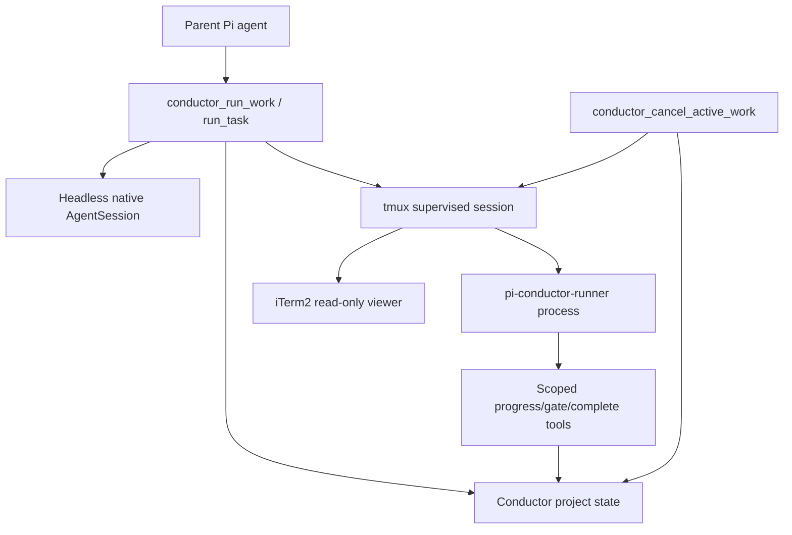

# feat: Add supervised visible runtime for pi-conductor

## Overview

Add an optional supervised visible runtime to `packages/pi-conductor` so a user can watch active workers while conductor remains the durable control plane. The first visible backend is tmux. iTerm2 support is a viewer layer over tmux on macOS, not a separate backend.

The current headless/native `AgentSession` path remains the default. Visible runs should preserve the same task/run/gate/artifact/event semantics: explicit child completion is authoritative, backend exit without completion creates review, and conductor-driven cancellation stops both persisted state and live runtime resources.

## Requirements Trace

### Defaults and selection

* R1. Keep headless/native execution as default and non-regressed.
* R2. Add runtime selection for `headless`, `tmux`, and `iterm-tmux` user-facing modes.

### Runtime metadata and execution

* R3. Persist tmux runtime metadata on run attempts: session name, pane/window IDs where available, cwd/worktree, log path, viewer command, launch/cleanup status.
* R4. Execute tmux-backed work through a conductor-owned runner process that can use the same scoped task contract and child reporting semantics as headless runs.

### Cancellation and reconciliation

* R5. Make cancellation terminate supervised runtime resources and persist terminal run/task/worker state.
* R8. Reconcile stale or orphaned tmux runtime state without inventing successful completion.

### Viewer and supervision UX

* R6. Treat iTerm2 as optional viewer-only polish; fallback to tmux attach commands when iTerm2 cannot open.
* R7. Make natural-language visible supervision ergonomic for requests such as “run this in parallel and show me the workers”.

### Logs and test coverage

* R9. Store logs as bounded artifact/local refs, not inline project-state blobs.
* R10. Cover backend selection, launch metadata, cancellation, iTerm fallback, and reconciliation with tests.
* R11. Guard natural-language runtime selection with a maintained phrase matrix covering status-only, execution, visible supervision, explicit runtime, and negated runtime wording.
* R12. Clean up conductor-owned pending work if runtime startup fails after high-level preflight but before a durable run becomes active, without touching unrelated pre-existing work.

## Supervision Approach Rationale

The first implementation intentionally chooses a tmux-backed visible runtime instead of only improving conductor-native status output.

| Approach | Value | Limitation |
| --- | --- | --- |
| Conductor-native visibility only | Lowest runtime risk; can expose project briefs, event streams, log tails, gates, and cancel commands. | Does not let a human watch the live worker terminal/session while tools, model output, and runtime transitions occur. |
| tmux-backed visible runtime | Gives a durable, scriptable, cancelable live surface for each worker while preserving conductor-owned state. | Adds process supervision, log lifecycle, and reconciliation complexity. |
| iTerm2 viewer over tmux | Polishes the macOS supervision experience and makes worker panes easy to find. | GUI launch is best-effort and must not own lifecycle or task state. |

Tmux is required for this slice because the user goal is live supervision, not only post-hoc status. Conductor-native surfaces still remain primary: every visible run must expose its conductor task/run state, attach command, log ref, and cancellation affordance through conductor status/tool output so the terminal never becomes the only way to understand or stop work.

## Key Technical Decisions

| Decision | Rationale |
| --- | --- |
| Add a backend boundary before tmux implementation | Prevents tmux-specific code from spreading through task lifecycle logic. |
| Use tmux as visible runtime owner | tmux is scriptable, inspectable, killable, and independent of GUI availability. |
| Use iTerm2 only as viewer | Keeps conductor/tmux as the control plane and avoids GUI-owned run state. |
| Default viewer attach to read-only where possible | Supervision should not bypass conductor state or scoped child tools. |
| Treat read-only viewing as best-effort affordance, not a security boundary | A user can still manually attach to tmux outside conductor; conductor state remains authoritative either way. |
| Use a persisted runner contract | A tmux process cannot depend on parent-process memory for task/run scope. |
| Add a package-owned runner CLI | Tmux launch needs one stable executable boundary across source checkouts, installed packages, and smoke tests. |
| Keep cancellation idempotent and terminal states monotonic | Cancellation may race with natural process exit, child completion, or prior cleanup. |
| Prefer explicit runtime selection over keyword inference | Natural-language “show” is ambiguous; explicit params/config must take precedence over inferred visible mode. |

## Resolved Implementation Decisions

* **Runner entrypoint:** add a package-owned CLI entrypoint, `pi-conductor-runner`, in `packages/pi-conductor/package.json`. Because the package is currently source-only TypeScript with no build output, first implementation uses a committed plain-JavaScript shim such as `extensions/runner-cli.mjs` as the `bin` target. The shim resolves the sibling runner module and launches it with the current Node executable and the repository's supported TypeScript-loading strategy; tmux preflight must verify that the resolved command is executable from the worker worktree. If the source-loading strategy is not reliable outside Pi, PR A must add a minimal build/shim strategy before any tmux launch work proceeds. The tmux adapter launches the resolved command from the worker worktree with argv such as `--repo-root`, `--project-key`, `--task-id`, `--run-id`, and `--contract`. The runner reconstructs scope from the persisted contract and current conductor project state; it does not depend on parent-process memory.
* **Runner command contract:** use argv-based process launch wherever possible. Any tmux command string that must pass through a shell is built by one adapter with centralized quoting tests for spaces, quotes, semicolons, newlines, and command-substitution characters.
* **Runtime selection:** explicit tool/run parameters win, then conservative natural-language inference. Project/user defaults are deferred; when added later, they should fit between explicit params and inference. Ambiguous phrases such as “show me current workers” must return status rather than launch visible work. Explicit visible runtime requests do not silently fall back to headless when tmux is missing; they return an actionable preflight error. `iterm-tmux` may fall back to `tmux` when only the viewer fails.
* **View/reopen affordance:** first implementation does not need a separate `conductor_view_run` tool. Status/tool outputs must always include enough attach/reopen detail for active visible runs. Add a dedicated view tool only if manual attach commands prove insufficient.
* **Real-tmux smoke:** add a skip-when-`tmux`-missing smoke test. It may run in CI when tmux is available, but the feature cannot rely on CI tmux availability.

## State, Race, and Cancellation Model

Visible runtime adds a second process, so terminal-state precedence must be explicit before tmux launch code lands.

| Event / race | Required behavior |
| --- | --- |
| Explicit child completion persists before backend exit | Preserve the semantic completion. Backend exit only records runtime evidence unless it contradicts completion and needs review. |
| Backend exits without explicit completion | Mark the task `needs_review` and create a review gate only if the run is still nonterminal. |
| Cancellation persists before child completion | Cancellation wins. Late child completion/progress is rejected or audited without changing terminal task/run state. |
| Child completion and cancellation race | Whichever transition commits first wins through the storage mutation envelope. The losing transition records a rejected/audited event and must not overwrite terminal state. |
| Reconciliation sees a terminal run | Reconciliation never overwrites terminal success, failure, cancellation, or needs-review state. It may append runtime evidence/diagnostics. |
| Parent and runner contend on conductor file lock | Runner and parent mutations use bounded retry with jitter/backoff on lock contention and preserve idempotency keys across retries. Expired retries create diagnostics instead of silently dropping completion. |
| Tmux session already gone during cancel | Cancellation remains idempotent: persist canceled/aborted conductor state if still active, record that runtime cleanup found no live session, and return success with diagnostics. |

Tests must cover cancel-while-complete, cancel-while-runner-blocked, backend-exit-before-completion, late-child-write-after-cancel, reconciliation-after-terminal-run, and file-lock contention between parent and runner writes.

## Liveness and Reconciliation Contract

Tmux session existence is not sufficient proof that a worker run is healthy. A tmux-backed run must persist enough liveness evidence for conductor to distinguish visible terminal state from runner process state.

Minimum runtime metadata:

* runtime mode (`tmux` or `iterm-tmux`)
* tmux session name and pane/window identifiers where available
* worker worktree/cwd
* runner command label and argv shape with secret values omitted
* runner PID and process group when available
* last runner heartbeat timestamp
* log path and log lifecycle status
* viewer attach command and viewer warning/status
* launch, cleanup, and reconciliation diagnostics

Reconciliation probes must cover:

* tmux session missing while conductor run is active
* tmux session alive but runner PID/process group exited
* tmux session alive but runner heartbeat stale
* pane command replaced by shell or unknown process when detectable
* tmux session missing after successful explicit completion
* log path missing/unreadable
* cleanup failed or partially completed

Unknown liveness never becomes success. Depending on persisted semantic state, reconciliation records `stale`, `needs_review`, `aborted`, or diagnostic-only evidence.

## Security and Local File Policy

Visible runtime crosses shell, filesystem, terminal, and local process boundaries. The first implementation must include these controls, not defer them to hardening:

* Launch runner processes with argv arrays where possible; isolate unavoidable shell strings in one tmux adapter with escaping tests.
* Validate and normalize cwd, contract path, log path, and conductor storage path before launching.
* Create runner contract files under conductor-owned storage with restrictive permissions (`0600` where supported), atomic writes, task/run/revision binding, and no long-lived secrets.
* Include a per-run nonce or capability value in the runner contract so a stale or tampered process cannot forge progress/completion for a different run. The first implementation treats this as valid for the active run/lease generation rather than as a wall-clock-expiring secret; terminal state, cancellation, cleanup, or lease-generation change invalidates it.
* Revalidate task ID, run ID, task revision, and nonce before every runner-originated progress/gate/completion mutation.
* Store logs under conductor-owned storage, outside repository source control, with restrictive permissions.
* Define per-run log size limits, truncation markers, and rotation behavior. Log write failure must produce runtime diagnostics and must not block conductor cancellation.
* Treat terminal logs and tmux scrollback as potentially sensitive. Status output may show local log refs/paths, but must not inline unbounded logs, tmux history, or secret environment values.
* Set an explicit tmux history limit for supervised sessions, avoid persisting tmux history outside the bounded log policy, and kill/clear supervised tmux buffers during cleanup where feasible.
* Use a conductor-owned tmux namespace: prefer a private tmux socket path under conductor storage with restrictive directory permissions, plus an unguessable per-run/session component. Before attach, cancel, or reconcile acts on an existing session, verify expected metadata such as runner PID/process group, cwd, run ID marker, contract path, and nonce binding where available.
* Do not expose writable viewer commands as the default. If a debug/writable attach mode is ever added, it must be explicitly labeled as outside normal conductor supervision.
* Apply the same argv/escaping discipline to iTerm2 viewer launch as to tmux launch. Any AppleScript, shell, URL, or open-handler boundary must have dedicated escaping tests, including AppleScript-specific delimiters.

## Runner Environment and Credential Contract

The visible runner must be equivalent enough to headless `AgentSession` execution to do real work, but it must not blindly inherit the parent process environment.

* Launch with a deny-by-default environment. Start from a small allowlist required for local execution, such as `PATH`, `HOME`, `SHELL` when needed by tools, `TMPDIR`, locale variables, and `PI_CONDUCTOR_HOME`.
* Do not put secrets in argv, contract files, runtime metadata, status output, tmux titles, or logs.
* Prefer the same Pi SDK/AuthStorage/config-file lookup path used by headless execution for provider credentials. If a provider is configured only through environment variables, pass only explicitly allowlisted provider variables and redact their names/values in diagnostics according to existing project security conventions.
* Preflight visible runner environment before task launch: resolved runner command, Node/runtime compatibility, required non-secret env, model/provider availability, worktree cwd, contract path, log path, and conductor storage writability.
* If visible runtime cannot obtain required config/credentials safely, fail before task execution with actionable diagnostics and no silent headless fallback for explicit visible requests.
* Add tests proving ambient secrets are not inherited by default, required config absence fails during preflight, and redaction prevents secret values from entering logs/status.

## Heartbeat and Stale Detection Policy

Heartbeat is liveness evidence, not semantic completion and not sufficient by itself to declare a live run dead.

* Prefer a heartbeat mechanism that can continue while the runner awaits model/tool/subprocess work. If the first implementation cannot guarantee that independence, stale heartbeat while runner PID/process group is still alive is a warning/diagnostic, not an automatic terminal transition.
* Reconciliation may mark a run stale/needs-review only when heartbeat evidence combines with stronger evidence such as missing runner process, exited process, missing tmux session, expired lease with no process evidence, or explicit runtime error.
* Long-running model/tool/subprocess waits must be tested so healthy work is not falsely moved to stale/needs-review solely because no heartbeat was emitted during a blocking wait.
* Completion/cancellation monotonicity still wins: a late valid completion can commit only if the run remains nonterminal; a terminal cancel/completion rejects or audits late heartbeat/progress.

## Supervision UX Contract

Visible supervision is not complete just because a terminal opens. Every visible run must be understandable and controllable from conductor output.

Minimum per-run status fields:

* worker name and worker ID
* task title and task ID
* run ID and task revision
* conductor task/run state
* runtime mode and runtime status
* viewer state: opened, manual attach available, warning, or unavailable
* read-only attach command for active tmux sessions
* log ref/path and whether the log is complete, partial, truncated, or unavailable
* recommended cancellation command/tool call
* latest progress or last runtime diagnostic

Multi-worker status should group runs in this order: active with warnings, active healthy, blocked/needs review, canceled/aborted, completed. Project-level briefs show a compact row per visible run; task/run details show full attach/log/runtime metadata.

Visible runtime state table:

| State | User-facing behavior |
| --- | --- |
| starting | Show task/run identity, runtime mode, and “starting tmux session”. |
| running/viewable | Show read-only attach command, log ref, latest heartbeat/progress, and cancel command. |
| running/no viewer | Show tmux attach command plus iTerm/viewer warning; task remains active. |
| no visible runs | Status says no visible conductor runs are active; do not imply no conductor tasks exist. |
| tmux unavailable | Explicit visible request fails with actionable preflight error; no silent headless fallback. |
| iTerm unavailable | Continue tmux run, show manual attach command and viewer warning. |
| partial worker launch | Show which workers launched, which failed preflight, and how cancellation affects launched workers. |
| viewer closed | Run remains active; status shows reopen/attach command. |
| session missing | Reconcile to stale/needs-review/aborted according to semantic state and diagnostics. |
| runner exited without completion | Task moves to `needs_review`; status links log ref, runtime diagnostics, and review gate with recovery actions. |
| canceled | Show terminal conductor state, cleanup result, log ref, and any cleanup warning. |
| cleanup failed | Show terminal task/run state plus recoverable cleanup diagnostics. |

Log-state behavior:

| Log state | User-facing behavior |
| --- | --- |
| complete | Show log ref/path and terminal outcome. |
| partial | Label the log as partial and point to runtime diagnostics/reconciliation before trusting it as full evidence. |
| truncated | Show truncation marker, retained byte count, and the fact that older output was rotated or dropped. |
| missing/unreadable | Show warning/error, recommend reconciliation, and keep task semantics based on run state rather than log availability. |
| unavailable | Explain that live supervision/log capture did not start; include runtime launch diagnostics and retry/cancel guidance. |

## Needs-Review Recovery Flow

Visible runtime failures that produce `needs_review` must give the user a clear recovery path.

Required status/task-detail content for visible `needs_review`:

* task title, task ID, run ID, worker name, runtime mode, and gate ID
* completion evidence status: explicit completion missing, backend exited, stale heartbeat, missing tmux session, log unavailable, or contradictory evidence
* log ref/path and whether it is complete, partial, truncated, missing, or unavailable
* latest runtime diagnostics and relevant timeline events

Primary recovery actions:

1. **Inspect evidence:** read bounded log/runtime artifacts and recent timeline before deciding.
2. **Retry visible:** create a new visible run when the worker/runtime is recoverable and the user still wants supervision.
3. **Retry headless:** rerun through headless/native runtime when tmux/viewer caused the failure.
4. **Mark failed / keep needs-review:** leave the task unresolved with explanation if evidence is insufficient.
5. **Cancel/abort cleanup:** terminate any remaining runtime resources if reconciliation shows leftovers.

Approving completion based only on logs should remain a deliberate review decision, not an automatic fallback from backend exit.

## Visible Output Contract

A tmux session must show human-meaningful live activity, not only run a silent wrapper around background state mutations.

Minimum pane output:

* startup banner with worker name, task title, task ID, run ID, cwd, runtime mode, attach/log refs, and cancellation command
* runtime lifecycle events: starting, running, heartbeat/stale warnings, cancellation requested, cleanup result, terminal state
* child progress events and gate/blocker requests as they are recorded
* bounded summaries of tool invocations/results when the SDK/runtime exposes them safely
* final completion, failure, aborted, or needs-review summary with the log ref and conductor task/run state

The bounded log should capture the same human-readable stream plus stdout/stderr from the runner. If full model-token streaming or full tool transcripts are not available from the current SDK surface, the runner must still print progress/event summaries so the pane is visibly useful. Smoke tests should assert that a visible run produces identity, progress/lifecycle, and terminal-status output in the pane/log; metadata-only success is not enough.

## Multi-Worker Launch Policy

Visible parallel launch should avoid surprising partial execution.

* Preflight global visible-runtime requirements before creating or launching worker runs where possible: tmux availability, runner executable resolution, conductor storage/log/contract writability, and iTerm viewer capability if explicitly requested.
* Use a two-phase launch barrier for visible parallel requests. Phase 1 may create conductor run reservations and launch tmux sessions into a pre-start state that prints identity/status but does not begin the task `AgentSession` work. Phase 2 starts task execution only after every requested visible session reaches launch acceptance.
* If any worker fails before the barrier, conductor cancels/cleans up the launched pre-start subset, records diagnostics, and returns a partial-launch failure without claiming side-effect rollback beyond lifecycle cleanup.
* If any task execution has already crossed the start barrier, later individual run failures are normal per-run outcomes and do not automatically cancel sibling workers.
* If implementation cannot provide a pre-start barrier in the first tmux slice, the response must explicitly state that side effects may have occurred, list changed worktrees/artifacts/events where known, and avoid wording that implies rollback.
* Status output for partial launch must show which workers launched, which failed preflight/launch, which were canceled by cleanup, whether task execution had started, and the exact cancellation/retry command.

## Open Questions

### Resolved for this plan

* **Should visible runtime be tmux-first or iTerm-first?** tmux-first; iTerm2 attaches to tmux as a viewer.
* **Should headless change behavior?** No; it remains the default path.
* **Should direct human typing into panes be part of this slice?** No; default to read-only supervision and treat read-only as best-effort, not as the correctness boundary.
* **Should the runner be a CLI or internal module?** Use a package-owned CLI entrypoint, `pi-conductor-runner`, so tmux has one stable executable boundary.
* **Should visible runtime be opt-in per tool call or configurable?** First implementation uses explicit tool/run params; project/user defaults are deferred.
* **Should there be a separate `conductor_view_run` tool in the first slice?** No; status/tool output must include attach/reopen commands first.

### Deferred to implementation

* Exact TypeScript names for runtime metadata types and fields in `RunAttemptRecord`.
* Exact runner CLI flag names and whether the contract path alone can imply repo/project IDs.
* Exact TypeScript-loading/build details for the `pi-conductor-runner` shim if Node source loading is not reliable in installed packages.
* Exact heartbeat interval and stale threshold defaults, subject to the rule that stale heartbeat alone cannot terminalize a live runner process.
* Exact per-run log byte limit, tmux history limit, and retention duration.

## High-Level Design



Runtime ownership boundaries:

| Layer | Owns | Does not own |
| --- | --- | --- |
| Conductor state | task/run lifecycle, gates, artifacts, events, cancellation decision | terminal UI rendering |
| Runtime backend adapter | launch, runtime metadata, process/tmux cleanup, backend diagnostics | semantic task success |
| Runner process | executing the task contract and reporting scoped progress/completion | durable task state outside scoped tools |
| tmux session | supervised visible process and terminal buffer | durable orchestration state |
| iTerm2 viewer | optional human view attached to tmux | process lifecycle or task state |

## Implementation Units

### U1. Introduce runtime backend metadata and selection tests

**Goal:** Define runtime mode names, metadata shape, and selection behavior without changing execution yet.

**Requirements:** R1, R2, R3, R10.

**Files:**

* Modify: `packages/pi-conductor/extensions/types.ts`
* Modify: `packages/pi-conductor/extensions/backends.ts`
* Modify: `packages/pi-conductor/extensions/runtime.ts`
* Modify: `packages/pi-conductor/extensions/task-service.ts`
* Test: `packages/pi-conductor/__tests__/backends.test.ts`
* Test: `packages/pi-conductor/__tests__/runtime-run.test.ts`
* Test: `packages/pi-conductor/__tests__/storage.test.ts`

**Approach:**

* Add user-facing runtime names: `headless`, `tmux`, `iterm-tmux`.
* Preserve current `native` storage behavior through compatibility mapping if needed.
* Add a run-level runtime metadata field that can represent headless and visible runtimes.
* Add metadata fields for runner PID/process group, heartbeat, log lifecycle, viewer command/status, and cleanup diagnostics.
* Make run details/status include runtime metadata when present.
* Add tests that current headless runs produce equivalent behavior to today.

**Verification:**

* Typecheck passes.
* Existing conductor tests still pass.
* New tests prove runtime selection/metadata can be persisted without tmux installed.

### U2. Extract backend interface around existing headless runtime

**Goal:** Route current headless execution through the same backend interface that tmux will implement.

**Requirements:** R1, R2, R4, R10.

**Files:**

* Modify: `packages/pi-conductor/extensions/runtime.ts`
* Modify: `packages/pi-conductor/extensions/conductor.ts`
* Modify: `packages/pi-conductor/extensions/task-service.ts`
* Test: `packages/pi-conductor/__tests__/run-flow.test.ts`
* Test: `packages/pi-conductor/__tests__/runtime-run.test.ts`

**Approach:**

* Define an interface that can preflight, start, observe/finalize, cancel, and reconcile runtime work.
* Implement the current in-process `AgentSession` path behind the interface.
* Keep child scoped tools and fallback review behavior unchanged.
* Ensure backend preflight failures happen before misleading active state where possible.
* Add terminal-state precedence tests before introducing tmux.

**Verification:**

* Existing explicit-completion and fallback-review tests pass through the interface.
* Cancellation still aborts live in-process work.
* Terminal-state precedence tests pass for the headless backend before tmux is added.

### U3. Add tmux runner contract and mocked tmux adapter

**Goal:** Implement tmux launch/cancel/reconcile behavior behind an adapter seam, with shell execution mocked in unit tests.

**Requirements:** R3, R4, R5, R8, R9, R10.

**Files:**

* Add: `packages/pi-conductor/extensions/tmux-runtime.ts`
* Add: `packages/pi-conductor/extensions/runner.ts`
* Modify: `packages/pi-conductor/package.json`
* Modify: `packages/pi-conductor/extensions/runtime.ts`
* Modify: `packages/pi-conductor/extensions/conductor.ts`
* Test: `packages/pi-conductor/__tests__/tmux-runtime.test.ts`
* Test: `packages/pi-conductor/__tests__/recovery.test.ts`

**Approach:**

* Add `pi-conductor-runner` as the package runner CLI entrypoint via a committed JavaScript shim and package `bin` entry.
* Build a tmux command adapter with injectable argv/spawn/exec functions.
* Preflight `tmux` availability and runner executable resolution before selecting the tmux backend.
* Generate shell-safe tmux session names from project/run IDs plus an unguessable per-run/session component.
* Use a conductor-owned private tmux socket/namespace where practical, stored under conductor storage with restrictive permissions.
* Create conductor-owned contract and log paths under project storage with restrictive permissions.
* Launch `pi-conductor-runner` in tmux with a persisted task/run contract, worker worktree cwd, and the runner environment/credential contract defined above.
* Persist tmux metadata, runner PID/process group when available, heartbeat metadata, log ref, viewer command, and launch diagnostics immediately after launch acceptance.
* Verify expected session metadata before attach, cancel, or reconcile acts on an existing tmux session.
* Implement cancel as idempotent tmux session/process termination.
* Implement reconcile probes for missing sessions, exited runner process, stale heartbeat, replaced pane command when detectable, missing logs, and partial cleanup.
* Test path and argument escaping with spaces, quotes, semicolons, newlines, command-substitution characters, and tmux session/socket collision attempts.

**Verification:**

* Mocked tests cover launch command shape, metadata persistence, cancellation idempotency, missing-session reconciliation, stale heartbeat reconciliation, and shell/path metacharacter escaping.
* No test requires real tmux yet.

### U4. Wire real runner process to scoped child reporting

**Goal:** Ensure a tmux-launched runner can execute the task contract and mutate conductor state through the same child progress/gate/complete semantics as headless execution.

**Requirements:** R4, R5, R8, R9, R10.

**Files:**

* Modify: `packages/pi-conductor/extensions/runner.ts`
* Modify: `packages/pi-conductor/extensions/runtime.ts`
* Modify: `packages/pi-conductor/extensions/storage.ts`
* Test: `packages/pi-conductor/__tests__/run-flow.test.ts`
* Test: `packages/pi-conductor/__tests__/runtime-run.test.ts`

**Approach:**

* Persist enough run contract data for `pi-conductor-runner` to reconstruct scope.
* Reuse `buildTaskContractPrompt` and `buildRunScopedConductorTools` where possible.
* Include task ID, run ID, task revision, repo/project identity, and an active-run/lease-generation-bound nonce/capability in the contract.
* Validate task/run/revision/nonce before every runner-originated progress/gate/completion mutation.
* Ensure runner process writes progress/completion through file-locked conductor mutations with bounded retry, jitter/backoff, and idempotency-key preservation.
* Implement heartbeat according to the heartbeat/stale policy: stale heartbeat alone is diagnostic while runner PID/process evidence remains healthy.
* Map runner/AgentSession exits to the same semantic fallback policy as headless runs only when the run is still nonterminal.
* Reject/audit late runner writes after cancellation or any terminal run state.
* Record completion reports/log refs as artifacts.

**Verification:**

* Tests simulate a runner process completing, blocking, failing, and exiting without explicit completion.
* Tests cover completion racing with cancellation, backend exit racing with completion, stale runner write after cancellation, long-running completion after heartbeat renewal/stale-threshold windows, heartbeat-stale-while-PID-alive diagnostics, and lock contention during completion.
* Project state matches headless semantics for equivalent outcomes.

### U5. Add iTerm2 viewer adapter and viewer/status output

**Goal:** Open iTerm2 as a best-effort read-only tmux viewer on macOS and expose viewer details through status/tools.

**Requirements:** R3, R6, R7, R10.

**Files:**

* Add: `packages/pi-conductor/extensions/iterm-viewer.ts`
* Modify: `packages/pi-conductor/extensions/status.ts`
* Modify: `packages/pi-conductor/extensions/tools/orchestration-tools.ts`
* Modify: `packages/pi-conductor/extensions/commands.ts`
* Test: `packages/pi-conductor/__tests__/runtime-run.test.ts`
* Test: `packages/pi-conductor/__tests__/commands.test.ts`
* Test: `packages/pi-conductor/__tests__/status.test.ts`

**Approach:**

* Detect macOS and iTerm2 availability separately from tmux availability.
* Open iTerm2 with a read-only tmux attach command when requested.
* Build iTerm2/AppleScript/open-handler commands through a dedicated adapter with escaping tests equivalent to the tmux adapter.
* If iTerm2 open fails, return a warning and attach command without failing the tmux run.
* Treat read-only viewer behavior as an explicit default, but document that it is not a security/correctness boundary because users can manually attach outside conductor.
* Show worker/task/run identity, conductor state, runtime status, viewer status, attach command, log ref, cancellation command, and latest warning/progress in run/task/project briefs.
* Implement the visible runtime state table from this plan in status output tests.
* Do not add `conductor_view_run` in this slice unless manual attach commands are insufficient during smoke testing.

**Verification:**

* Tests mock macOS/iTerm success and failure.
* Status output includes manual read-only attach commands and cancellation affordances.
* iTerm failure does not mark the run failed.
* Status tests cover starting, running/viewable, running/no viewer, no visible runs, missing session, runner exited without completion, canceled, and cleanup failed states.

### U6. Make natural-language visible work ergonomic

**Goal:** Let parent agents select visible runtime naturally for “run this and show me the workers” requests without surprising users who only ask for status.

**Requirements:** R2, R5, R6, R7, R10.

**Files:**

* Modify: `packages/pi-conductor/extensions/tools/orchestration-tools.ts`
* Modify: `packages/pi-conductor/extensions/conductor.ts`
* Modify: `packages/pi-conductor/README.md`
* Test: `packages/pi-conductor/__tests__/conductor.test.ts`
* Test: `packages/pi-conductor/__tests__/planner-quality.test.ts`

**Approach:**

* Add explicit runtime/viewer params to high-level orchestration tools.
* Apply runtime selection precedence for the first implementation: explicit params, then conservative natural-language inference.
* Infer visible runtime only from unambiguous execution requests such as “run this and show/open/watch the workers”.
* Treat status-only phrases such as “show me current workers” as inspection, not visible-runtime launch.
* Keep conservative routing: visible runtime can be selected only when work is otherwise safe to run/split.
* Explicit `tmux` requests fail with actionable tmux preflight errors if tmux is unavailable; they do not silently fall back to headless.
* Explicit `iterm-tmux` requests may fall back to tmux-only when iTerm2 viewer launch fails.
* Return structured viewer details and status/warning summaries for all started workers/runs.
* Ensure cancellation can target all visible runs started by a natural-language orchestration boundary.

**Verification:**

* Natural-language visible parallel requests select visible runtime in tests.
* Ambiguous “show” status requests do not launch tmux.
* Visible runtime preflight failure returns actionable diagnostics without creating misleading active runs.
* Natural-language stop cancels visible active work without user-supplied IDs.

### U7. Add smoke tests, phrase matrix coverage, and documentation

**Goal:** Provide human-style validation for visible supervision, keep runtime-selection heuristics regression-resistant, and make cleanup/recovery clear.

**Requirements:** Validates R1-R11; implements documentation/test coverage for R6, R7, R8, R9, R10, and R11.

**Files:**

* Modify: `packages/pi-conductor/README.md`
* Add or modify: `packages/pi-conductor/__tests__/package-smoke.test.ts`
* Add: `packages/pi-conductor/__tests__/work-runtime-selection.test.ts`
* Add optional script/docs note for local real-tmux smoke testing.

**Approach:**

* Add a real-tmux smoke test that skips when `tmux` is unavailable.
* Smoke: start visible parallel work, inspect tmux sessions/log paths, cancel active work, verify sessions gone and persisted state terminal.
* Add a table-driven runtime-selection phrase matrix for status-only, normal execution, visible supervision, direct `tmux`/`iterm-tmux`, negated runtime wording, and explicit `runtimeMode` override precedence.
* Include regression phrases that previously confused noun/verb intent, such as `show run status`, `inspect current run`, `list active task`, `watch current worker status`, `open current run output`, `show tmux sessions`, and `run this without tmux`.
* Document manual attach, iTerm fallback, status-only request guidance, cancellation, stale reconciliation, log retention, and cleanup commands.
* Verify that agent-visible tool output/details expose `runtimeMode`, `runtimeRuns`, viewer/log fields, and cancellation affordances for visible runs.
* Do not use U7 as a catch-all feature slice. Runtime startup cleanup belongs in U8. Other defects discovered during smoke testing become focused bug-fix tasks unless they are necessary for the smoke test to pass.

**Verification:**

* `npm run typecheck`
* `npx vitest run packages/pi-conductor/__tests__`
* Local smoke with tmux installed proves visible runtime can start, be watched, canceled, and reconciled.
* Phrase matrix tests prove status-only wording never launches visible runtime and explicit runtime params still win.

### U8. Clean up owned startup failures after preflight races

**Goal:** Close the remaining post-preflight startup-failure race by ensuring high-level visible orchestration does not leave conductor-owned tasks stuck as assigned/ready when the runtime disappears between preflight and run start.

**Requirements:** R5, R8, R10, R12.

**Files:**

* Modify: `packages/pi-conductor/extensions/conductor.ts`
* Modify or add helper module if extraction keeps `conductor.ts` under the static safety line-count guard.
* Test: `packages/pi-conductor/__tests__/conductor.test.ts`
* Test: `packages/pi-conductor/__tests__/tmux-cancel.test.ts`
* Test: `packages/pi-conductor/__tests__/scheduler.test.ts` or objective-specific tests if objective startup cleanup touches scheduling behavior.

**Approach:**

* Track the task IDs and worker IDs created or assigned by each high-level orchestration boundary before dispatching runtime work.
* When runtime/backend startup fails after top-level preflight but before an active run is created, cancel or mark failed only the owned pending tasks and release/recover only the owned workers that were part of the failed startup attempt.
* Preserve existing active-run cleanup semantics for failures after `startTaskRunForRepo` creates a run; those remain runtime cleanup/reconciliation concerns.
* Keep cleanup scoped: unrelated pre-existing tasks, workers, objectives, and runs must not be modified.
* Make failure contracts consistent enough for callers to understand which owned tasks were canceled, which active runs were cleaned up, and which failures still require review.
* Cover single, parallel, and objective high-level paths separately; do not make sibling task cancellation automatic after the task execution start barrier has been crossed.

**Verification:**

* Tests simulate runtime availability passing at high-level preflight and failing during lower-level runtime/backend startup before active run creation.
* Single, parallel, and objective tests assert owned pending tasks are terminalized or canceled instead of remaining assigned/ready.
* Tests assert unrelated pre-existing work remains unchanged.
* Existing cancellation, reconciliation, and headless tests continue to pass.

## Suggested PR Slices

1. **PR A — backend boundary and metadata:** U1 + U2 only; no real tmux launch.
2. **PR B — supervised tmux runtime:** U3 + U4 with mocked tests only; real-tmux smoke belongs to PR E.
3. **PR C — iTerm viewer and status output:** U5.
4. **PR D — natural-language visible ergonomics:** U6.
5. **PR E — docs/smoke/phrase-matrix hardening:** U7 only; add real-tmux smoke, runtime-selection phrase matrix coverage, agent-visible output checks, and docs.
6. **PR F — startup-failure cleanup hardening:** U8 only; close post-preflight runtime disappearance cases without broad runtime refactors.

## Test Plan

Run after each slice:

```bash
npx vitest run packages/pi-conductor/__tests__
npx tsc --noEmit --project packages/pi-conductor/tsconfig.json
npx biome ci packages/pi-conductor
```

Run before final PR:

```bash
npm run check
npm run test
```

Manual smoke for final feature:

0. Run the runtime-selection phrase matrix and confirm status-only phrases do not create work or infer visible runtime.
1. Start parallel natural-language conductor work with visible runtime intent.
2. Confirm tmux sessions/log paths exist and viewer details are returned.
3. Confirm status output maps worker name, task title, run ID, conductor state, runtime state, attach command, log ref, and cancel command.
4. If on macOS with iTerm2, confirm iTerm attaches as viewer.
5. Close the viewer and confirm status still exposes a reopen/attach command while the run continues.
6. Exercise a visible-run `needs_review` path and confirm status shows log/runtime evidence plus retry visible, retry headless, mark failed/keep review, and cleanup actions.
7. Cancel active conductor work through natural language or `conductor_cancel_active_work`.
8. Confirm tmux sessions are gone, tasks/runs are terminal, workers are idle/recoverable, logs are retained according to policy, and `PI_CONDUCTOR_HOME` state contains cancellation evidence.
9. Run reconciliation after cancellation and confirm it does not invent success or resurrect terminal runs.

## Rollback Plan

* Runtime selection should default to headless, so visible runtime can be disabled by config or by not selecting `tmux`/`iterm-tmux`.
* If tmux behavior proves unstable, keep backend metadata/interface changes but gate tmux launch behind explicit config until fixed.
* Do not remove or rewrite existing headless runtime paths during this work.

## Done Definition

* A user can request visible conductor work and receive/open tmux/iTerm viewer details.
* Every visible run can be understood from conductor output without reading the terminal pane.
* Canceling active visible work terminates the underlying runtime and persists terminal state.
* Late runner writes after terminal cancellation/completion are rejected or audited without changing terminal state.
* Reconciliation handles missing/exited/stale tmux sessions and stale runner heartbeat without inventing success.
* Runtime launch avoids unsafe shell interpolation and validates paths/arguments.
* Contract and log files use restrictive permissions, bounded retention, and no inline secret values.
* Existing headless conductor tests continue to pass.
* README and status/tool outputs explain how to supervise and stop visible workers.
