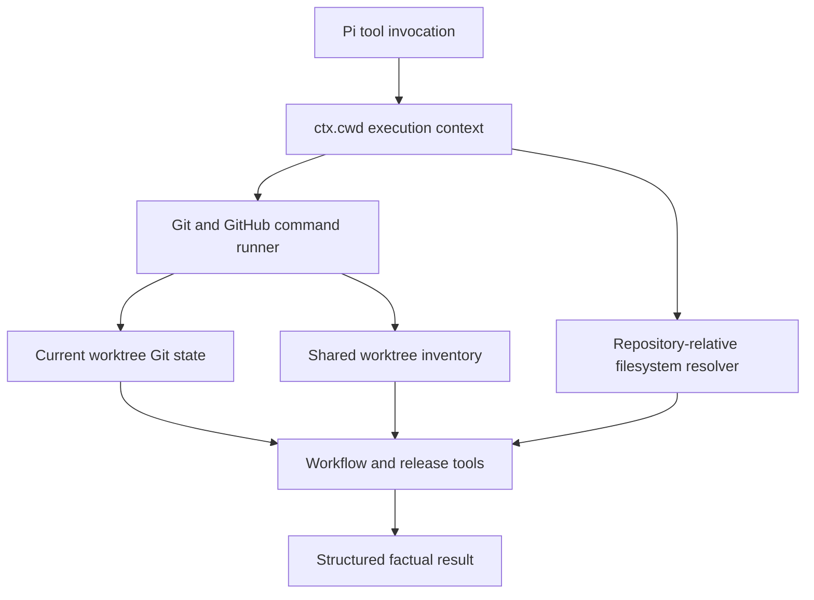
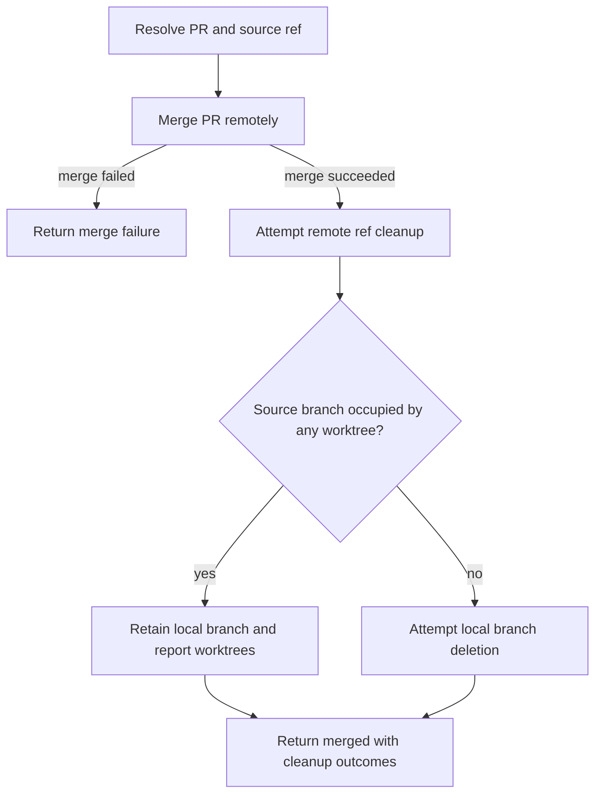

# Devtools Worktree Awareness - Plan

## Goal Capsule

- **Objective:** Make every `pi-devtools` operation act on Pi's active working directory and behave safely when the repository has linked Git worktrees.
- **Authority:** This plan's Product Contract defines scope; Git and GitHub CLI documented behavior constrains worktree discovery and branch cleanup; existing package conventions govern implementation shape.
- **Execution profile:** Test-first changes within `packages/pi-devtools`, preserving normal single-worktree behavior while adding linked-worktree coverage.
- **Stop conditions:** Stop if safe remote branch cleanup requires deleting or modifying a worktree, if a public tool parameter must change beyond additive result metadata, or if the installed GitHub CLI cannot expose authoritative PR head-repository/ref metadata for guarded cleanup.
- **Tail ownership:** The implementation must leave source, tests, skills, prompts, and README behavior aligned and remove abandoned experimental cleanup paths before completion.

---

## Product Contract

### Summary

Make `pi-devtools` explicitly worktree-aware by scoping commands and file operations to Pi's active cwd, exposing current/shared worktree context, and separating remote merge success from safe local branch cleanup.

### Problem Frame

The extension currently inherits the Node process working directory in `execGit`, `execGh`, and version-file operations even though Pi provides the active session directory as `ctx.cwd`. Tool calls can therefore inspect or mutate a different checkout than the one the agent is working in.

Git itself understands linked worktrees, but the package neither reports that topology nor accounts for it in merge instructions. Merge tools delegate both remote and local deletion to `gh pr merge --delete-branch`, report requested deletion as completed, and supporting skills instruct the agent to checkout the default branch after merging. Those assumptions fail when the default or source branch is checked out in another worktree.

### Requirements

**Execution context**

- R1. Every Git command, GitHub CLI command, session-start context lookup, and repository-relative filesystem mutation must execute against the invoking Pi context's `ctx.cwd`.
- R2. Existing behavior must remain available to direct helper consumers through an explicit or backward-compatible cwd contract rather than hidden reliance on `process.chdir`.
- R3. A normal repository with no linked worktrees must preserve current branch, commit, push, PR, CI, version, and release behavior except where result reporting becomes more accurate.

**Worktree context**

- R4. `devtools_get_repo_info` must return the current worktree root, private Git directory, common Git directory, linked-worktree status, HEAD state, and the repository's parsed worktree records.
- R5. Worktree records must preserve branch, HEAD, detached, locked, and prunable information and identify the record matching the active cwd.
- R6. Repository information must remain available on detached HEAD, while operations that require a branch continue to return an actionable detached-state error.

**Merge and cleanup safety**

- R7. Merge execution must not checkout the default branch, pull another checkout, remove a worktree, unlock a worktree, or prune worktree metadata.
- R8. A requested branch deletion must report remote deletion and local deletion as separate observed outcomes, including cleanup failures and worktree paths that retain the local branch.
- R9. A local branch checked out in any current, linked, locked, or conservatively retained prunable worktree record must not be deleted.
- R10. A successful merge followed by partial or skipped cleanup remains a successful merge result with incomplete cleanup details rather than being reported as a failed merge.

**Release and documentation behavior**

- R11. Version-file resolution, commit analysis, tag lookup, and release targeting must refer to the active worktree and its HEAD instead of the extension process directory or an ambient default branch.
- R12. Package skills, merge prompts, tool descriptions, and README documentation must describe worktree-aware behavior and must not promise unconditional checkout or local branch deletion.

### Acceptance Examples

- AE1. Given Pi is running in linked worktree B while the extension process was started from worktree A, when repo info, commit, push, PR, version bump, or release tools run, then every observed or mutated resource belongs to worktree B.
- AE2. Given a merged PR's source branch remains checked out in the active linked worktree, when deletion is requested, then remote cleanup is attempted independently and the local branch is retained with the active worktree path reported.
- AE3. Given a merged PR's source branch is checked out in another linked or locked worktree, when deletion is requested from the current checkout, then the other worktree is not changed and the retaining path/state is reported.
- AE4. Given the active worktree is on detached HEAD, when repo info runs, then it returns the active worktree and commit; when a branch-dependent operation runs, then it returns a detached-state error without invoking a remote mutation.
- AE5. Given a repository has no linked worktrees, when the same workflows run, then their successful outcomes remain equivalent to current behavior and the primary checkout is reported as not linked.

### Scope Boundaries

**In scope**

- Cwd propagation through all registered tools and session context.
- Parsing and reporting Git's stable worktree porcelain format.
- Worktree-aware local branch retention and factual merge-cleanup outcomes.
- Active-HEAD release targeting where the GitHub CLI would otherwise use an ambient default.
- Unit, integration, command-contract, skill, prompt, and README updates for `packages/pi-devtools`.

**Out of scope**

- Creating, adding, moving, locking, unlocking, repairing, pruning, or removing worktrees.
- Automatically switching to or updating the default branch after merge.
- Force-deleting local branches or bypassing Git worktree safeguards.
- Refactoring shell-string command construction to `execFileSync` or changing the package's synchronous execution model.
- General hardening for missing remotes, dirty branch switching, or repository path traversal unless required to preserve the confirmed worktree behavior.

### Success Criteria

- Operations invoked with a supplied cwd never read from or write to another checkout merely because it is the process cwd.
- Repo information gives an agent enough structured context to distinguish the active worktree from shared repository state.
- Merge results distinguish merge status, remote cleanup, local cleanup, and branch retention without claiming unobserved deletion.
- Linked-worktree integration tests cover active and other-worktree branch occupancy, while existing single-worktree tests remain green.
- User-facing workflow resources no longer instruct unsafe post-merge checkout or unconditional deletion.

---

## Planning Contract

### Key Technical Decisions

- KTD1. **Treat `ctx.cwd` as an execution invariant.** Tool registrations pass cwd into domain helpers, and shared Git/GitHub execution helpers set the child process `cwd`; repository-relative Node filesystem paths resolve from the same value. This follows Pi's extension context contract and the repository's documented package-local cwd pattern.
- KTD2. **Model worktree context once in the Git layer.** A shared parser consumes `git worktree list --porcelain -z`, while canonical paths come from `git rev-parse --path-format=absolute`. Workflow and merge logic consume this model instead of re-parsing command output independently.
- KTD3. **Keep helper compatibility explicit.** Existing exported helpers may retain an optional cwd default for direct tests/consumers, but registered Pi tools always provide `ctx.cwd`; new internal flows must not depend on ambient process state.
- KTD4. **Separate remote merge from cleanup.** The merge command does not use `gh pr merge --delete-branch`. After a confirmed remote merge, remote head-ref cleanup and local ref cleanup run as distinct best-effort stages with factual outcomes.
- KTD5. **Let worktree occupancy block local deletion.** Local deletion is attempted only when no parsed record claims the source branch. Locked records count as occupied; prunable records are retained conservatively because this scope does not repair or prune metadata.
- KTD6. **Represent partial cleanup without erasing merge success.** Tool details distinguish requested, succeeded, skipped/retained, and failed cleanup states. Existing top-level fields may be retained only as compatibility summaries derived from observed outcomes.
- KTD7. **Pin release creation to active HEAD.** When creating a tag through GitHub, the command supplies the active worktree's resolved target rather than relying on GitHub's default branch selection.
- KTD8. **Delete only the authoritative PR head ref.** Read `headRefName`, `headRepository`, `headRepositoryOwner`, and `isCrossRepository` from the PR plus the active repository's `nameWithOwner`. Remote cleanup uses an authenticated `gh api` DELETE against the URL-encoded ref under the exact head repository; missing/deleted metadata or permission/not-found responses become factual skipped/failed outcomes. Local deletion is eligible only when the head repository identity matches the active repository and U1's worktree inventory shows no occupancy, preventing a same-named local or base-repository branch from being mistaken for a fork head.

### High-Level Technical Design

The cwd boundary flows from Pi into every operation, while Git's private/common directory distinction provides worktree identity.

Merge and cleanup are a staged outcome rather than one `--delete-branch` side effect.

### Implementation Constraints

- Continue using shell quoting for user-controlled command values; adding cwd must not interpolate paths into shell command strings.
- Use Git's NUL-delimited stable porcelain format so whitespace, quoted characters, and lock reasons do not corrupt worktree records.
- Return absolute worktree/Git-directory paths in tool details because agents need unambiguous checkout identity; plan and documentation file references remain repo-relative.
- Do not mutate shared worktree metadata directly. Git commands remain the source of truth for repository topology and local-ref safety.
- Keep public tool parameter schemas stable unless an additive release target override is proven necessary during implementation.

### Sequencing

1. Establish the cwd-aware execution and worktree model with failing unit/integration tests.
2. Thread the context through all tool and filesystem paths, then prove checkout isolation.
3. Build merge cleanup on the worktree model and lock down partial-outcome contracts.
4. Align skills, prompts, README, and command-contract coverage with the implemented behavior.

### System-Wide Impact

This change improves agent context parity: the model receives the same active checkout identity that Pi uses, and tool mutations occur in the shared workspace the user expects. Structured results are safety-relevant because merge and release skills use them to decide whether further actions are appropriate. No other workspace package should change unless shared test configuration reveals an existing assumption.

### Risks and Mitigations

- **Git path variance:** `--git-dir` and `--git-common-dir` can otherwise be relative. Request canonical absolute output and verify primary plus linked worktrees.
- **Porcelain parsing:** Worktree paths and reasons may contain unusual characters. Parse the `-z` format and test spaces plus locked/prunable records.
- **Cross-repository PR cleanup:** A fork ref may be deleted, inaccessible, or outside the authenticated user's permissions. Target only the exact PR head repository/ref from GitHub metadata; classify missing metadata as skipped and authorization/not-found API responses as failed cleanup without retrying against the base repository.
- **Legacy result consumers:** Existing tests and skills may expect `deletedBranch: true`. Preserve only a truthful compatibility summary and document richer fields.
- **Mock brittleness:** Unit tests rely on exact command order. Prefer command-aware mocks and reserve real topology behavior for integration fixtures.

### Sources and Research

- `packages/pi-specdocs/extensions/index.ts` demonstrates tool execution callbacks consuming `ctx.cwd`.
- `docs/solutions/integration-issues/npx-bin-package-local-mcp-wrapper-2026-05-23.md` documents explicit cwd scoping and warns against caller-cwd-relative execution.
- [Git worktree list output](https://git-scm.com/docs/git-worktree#_list_output_format) defines the stable porcelain and NUL-delimited record format.
- [Git worktree details](https://git-scm.com/docs/git-worktree#_details) defines private `$GIT_DIR` versus shared `$GIT_COMMON_DIR` behavior.
- [Git rev-parse](https://git-scm.com/docs/git-rev-parse) defines canonical absolute worktree, Git directory, and common directory resolution.
- [Node.js `child_process.execSync`](https://nodejs.org/api/child_process.html#child_processexecsynccommand-options) supports an explicit child-process cwd.
- [GitHub CLI `gh pr merge`](https://cli.github.com/manual/gh_pr_merge) documents that `--delete-branch` combines local and remote deletion, motivating separated cleanup.

---

## Implementation Units

### U1. Cwd-aware Git context and worktree model

- **Goal:** Add the shared execution-context and worktree primitives that every later unit depends on.
- **Requirements:** R1, R2, R4, R5, R6.
- **Dependencies:** None.
- **Files:** `packages/pi-devtools/extensions/git.ts`, `packages/pi-devtools/__tests__/git.unit.test.ts`, `packages/pi-devtools/__tests__/git.integration.test.ts`.
- **Approach:** Extend Git/GitHub execution helpers with an explicit cwd contract; add canonical repository-path discovery and a typed NUL-porcelain worktree parser; represent branch and detached HEAD without making repo discovery fail.
- **Execution note:** Start with failing helper and real linked-worktree tests before changing command execution.
- **Patterns to follow:** Preserve centralized command wrapping in `packages/pi-devtools/extensions/git.ts`; mirror the explicit cwd pattern documented in `docs/solutions/integration-issues/npx-bin-package-local-mcp-wrapper-2026-05-23.md`.
- **Test scenarios:**
  1. With process cwd A and explicit cwd B, Git and GitHub runners pass B as the child-process cwd and return B's output.
  2. A primary checkout reports equal private/common Git directories and `isLinkedWorktree: false`.
  3. A linked checkout reports its private worktree Git directory, shared common directory, canonical worktree root, and `isLinkedWorktree: true`.
  4. NUL porcelain records preserve paths containing spaces and capture branch, detached, locked reason, and prunable reason fields.
  5. The active record is selected by canonical worktree root rather than basename.
  6. Detached HEAD returns commit identity and worktree metadata without fabricating a branch.
  7. A non-repository cwd returns the established not-a-repository behavior without falling back to process cwd.
- **Verification:** Helper tests prove cwd forwarding and parsing; integration fixtures prove primary and linked Git topology with no global `process.chdir` dependency.

### U2. Propagate active cwd through workflow and release tools

- **Goal:** Ensure every registered tool and session context uses the active Pi checkout, including direct filesystem mutations.
- **Requirements:** R1, R2, R3, R4, R6, R11.
- **Dependencies:** U1.
- **Files:** `packages/pi-devtools/extensions/index.ts`, `packages/pi-devtools/extensions/workflow-tools.ts`, `packages/pi-devtools/extensions/pull-request-tools.ts`, `packages/pi-devtools/extensions/release-tools.ts`, `packages/pi-devtools/__tests__/index.test.ts`, `packages/pi-devtools/__tests__/helpers.test.ts`, `packages/pi-devtools/__tests__/tools.test.ts`, `packages/pi-devtools/__tests__/git.integration.test.ts`.
- **Approach:** Consume the fifth Pi tool-execution context argument, pass cwd through every helper, resolve version files from that cwd, enrich repo-info text/details with U1's model, and target release creation at the active HEAD. Session-start Git context uses the session context rather than ambient process state.
- **Execution note:** Prove each registered tool receives a sentinel cwd before updating domain behavior; then add cross-worktree behavioral coverage.
- **Patterns to follow:** Follow the `ctx.cwd` callback shape in `packages/pi-specdocs/extensions/index.ts`; retain the package's synchronous helper/result organization.
- **Test scenarios:**
  1. Each registered tool passes a supplied sentinel `ctx.cwd` to its domain helper without requiring a process directory change.
  2. Covers AE1. With distinct files and branches in worktrees A and B, repo info, staging/commit, push/PR command generation, tag analysis, and version-file mutation invoked for B use only B.
  3. Covers AE4. Repo info on detached HEAD succeeds with commit/worktree details, while commit, push, implicit PR lookup, and other branch-required flows stop before remote mutation.
  4. Covers AE5. A single-worktree repository preserves existing successful workflow result semantics while adding non-linked metadata.
  5. A custom version file path resolves relative to active cwd and never reads the same relative path under process cwd.
  6. Release command generation uses the active HEAD target and retains existing draft/prerelease/note options.
  7. Session-start context displays the branch/status/tag and worktree identity belonging to `ctx.cwd`.
- **Verification:** Tool registration tests prove context propagation; package integration tests prove isolation; release and command generation assertions prove the active target is explicit.

### U3. Worktree-safe merge and branch cleanup

- **Goal:** Replace combined `gh` deletion side effects with observable remote and local cleanup that never disturbs an occupied worktree.
- **Requirements:** R7, R8, R9, R10.
- **Dependencies:** U1, U2.
- **Files:** `packages/pi-devtools/extensions/pull-request-tools.ts`, `packages/pi-devtools/extensions/shared.ts`, `packages/pi-devtools/__tests__/tools.test.ts`, `packages/pi-devtools/__tests__/command-contract.test.ts`, `packages/pi-devtools/__tests__/git.integration.test.ts`.
- **Approach:** Resolve the PR head repository owner/name, head ref, cross-repository flag, and active repository identity; merge without `--delete-branch`; URL-encode the ref and delete it through authenticated `gh api` against that exact head repository; then permit local-ref deletion only for a same-repository head with no worktree occupancy. Return `not_requested`, `deleted`, `retained`/`skipped`, or `failed` remote/local outcomes plus a truthful compatibility summary. Never fall back to deleting `origin/<headRefName>` when repository identity is missing or different.
- **Execution note:** Define expected result details in failing tests before changing merge commands, especially for partial cleanup.
- **Patterns to follow:** Continue validating generated GitHub CLI flags/JSON fields in `packages/pi-devtools/__tests__/command-contract.test.ts`; use `successResult` for a successful merge even when cleanup is retained or fails.
- **Test scenarios:**
  1. A merge with `deleteBranch:false` performs no remote or local cleanup and reports both as not requested.
  2. A merge with requested cleanup merges without GitHub CLI's combined deletion flag, then records independent remote/local outcomes.
  3. Covers AE2. When the source branch is checked out in the active worktree, local deletion is skipped, the path is returned, and merge success remains true.
  4. Covers AE3. When the source branch is checked out in another linked or locked worktree, no checkout/removal/deletion touches that worktree and its path/state is returned.
  5. A prunable record naming the source branch causes conservative local retention without pruning.
  6. When remote cleanup fails after merge, the result reports merged plus cleanup failure rather than `Failed to merge PR`.
  7. A same-repository PR deletes only the URL-encoded head ref in the repository identity returned by GitHub, then considers the matching local branch for deletion.
  8. A fork PR targets only the exact fork repository/ref; authorization or not-found failure is reported without retrying against the base repository or `origin`.
  9. Missing/deleted head-repository metadata skips remote cleanup and makes local cleanup ineligible rather than guessing from the branch name.
  10. When no worktree occupies a same-repository source branch, successful local deletion is observed before reporting it deleted.
  11. Command-contract validation covers the PR/repository JSON fields and authenticated API command supported by the installed CLI.
- **Verification:** Unit tests cover the result-state matrix and command contracts; a real multi-worktree fixture proves Git refuses no required safe path and that occupied refs remain intact.

### U4. Align agent workflows and package documentation

- **Goal:** Ensure skills, prompts, and package documentation consume and describe the new safety contract.
- **Requirements:** R7, R8, R10, R12.
- **Dependencies:** U2, U3.
- **Files:** `packages/pi-devtools/skills/brpr/SKILL.md`, `packages/pi-devtools/skills/merge/SKILL.md`, `packages/pi-devtools/skills/release/SKILL.md`, `packages/pi-devtools/prompts/md.md`, `packages/pi-devtools/prompts/smd.md`, `packages/pi-devtools/README.md`, `packages/pi-devtools/__tests__/index.test.ts`.
- **Approach:** Remove post-merge checkout/pull instructions and unconditional deletion claims; teach workflows to inspect worktree and cleanup result fields; document active-cwd behavior, linked-worktree retention, detached-state behavior, and the non-goal of worktree lifecycle management.
- **Patterns to follow:** Keep workflow instructions tool-oriented and preserve existing confirmation/CI gates; keep README tool tables synchronized with registered names and behavior.
- **Test scenarios:**
  1. Skill/prompt contract assertions reject instructions to checkout/pull the default branch after merge.
  2. Skill/prompt contract assertions require reporting retained local branches and partial cleanup distinctly from merge failure.
  3. Release guidance requires default-branch and clean-tree preconditions while acknowledging that the default branch may be checked out in another worktree rather than prescribing a checkout.
  4. README documents that tools act on Pi's active cwd and that they never create/remove/prune worktrees.
- **Verification:** Static resource assertions and review confirm that no shipped skill or prompt contradicts the implemented result contract.

---

## Verification Contract

| Gate | Command | Proves |
|---|---|---|
| Package unit and integration tests | `npx vitest run packages/pi-devtools/__tests__` | Cwd propagation, worktree parsing, merge cleanup outcomes, command contracts, and workflow-resource expectations. |
| Package lint | `npx biome ci packages/pi-devtools` | Formatting and lint compliance for source, tests, skills, prompts, and README. |
| Package typecheck | `npx tsc --noEmit --project packages/pi-devtools/tsconfig.json` | Typed cwd/worktree/result contracts compose across tool registration and helpers. |
| Workspace regression suite | `npm run test` | Shared extension and workspace behavior remains compatible. |
| Workspace checks | `npm run check` | Root Biome and TypeScript constraints remain satisfied. |
| Manual package smoke check | Run `pi -e packages/pi-devtools` once from a primary checkout and once from a linked worktree | Session context and `devtools_get_repo_info` identify the active checkout; no workflow silently operates in the other checkout. |

---

## Definition of Done

- R1-R12 are implemented and traceable to U1-U4 tests or documentation checks.
- Primary-checkout, linked-worktree, detached-HEAD, occupied-branch, locked-record, prunable-record, and partial-cleanup scenarios pass.
- Every registered tool and session-start context uses Pi's active cwd; no repository-relative filesystem operation remains ambient.
- Merge results report observed remote/local cleanup outcomes and never mutate or remove a worktree.
- Release creation targets the intended active HEAD, and version-file writes are isolated to the active checkout.
- Skills, prompts, tool descriptions, and README match the implemented contract without unconditional checkout/deletion claims.
- Package-scoped tests, lint, and typecheck pass; workspace regression checks pass.
- No public tool parameter is removed or incompatibly renamed.
- Experimental, dead-end, and duplicate cleanup code is removed from the final diff.
