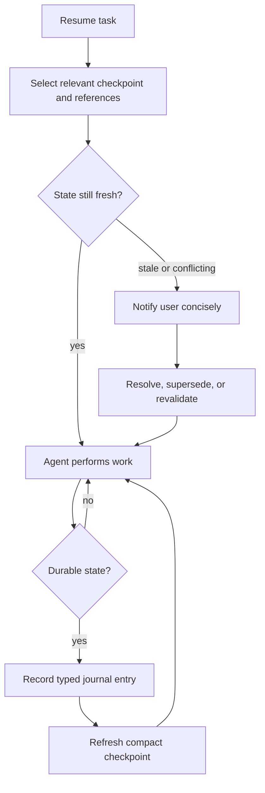
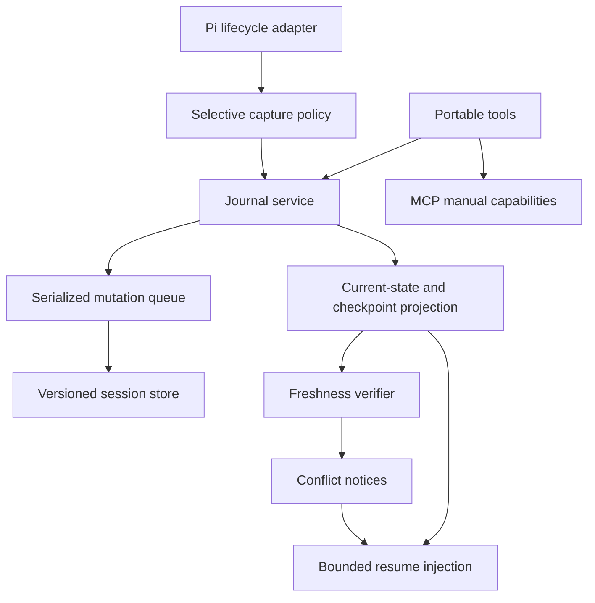
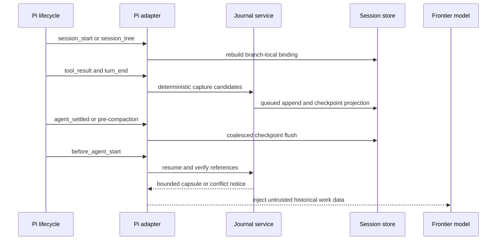

# Agent Work Journal - Plan

## Goal Capsule

- **Objective:** Replace the Code Reasoning and Sequential Thinking products with one active work journal that helps frontier-model agents resume accurately, retain decisions, and avoid repeated investigation.
- **Product authority:** The Product Contract controls behavior; this Planning Contract controls implementation; repository instructions and tests control execution details.
- **Execution profile:** Implement test-first in dependency order, evaluate the successor before cutover, then remove both predecessors in the same release change.
- **Stop conditions:** Stop rather than guess if implementation would store raw reasoning, weaken the journal-owned secret boundary, require autonomous MCP parity, or cannot satisfy the two-of-three evaluation gate.
- **Tail ownership:** `ce-work` owns implementation and verification; the shipping pipeline owns simplification, review, commit, PR, and CI follow-through.
- **Open blockers:** None. The implementation name is `@feniix/pi-agent-journal`; Pi owns autonomous behavior while MCP exposes the same four manual capabilities.

---

## Product Contract

### Summary

Create one agent work journal built around durable typed entries and compact checkpoints.
The journal autonomously captures durable work state, retrieves relevant prior context, and flags stale or conflicting records without prescribing how the model reasons.

### Problem Frame

Frontier models already handle transient decomposition, branching, revision, and tool-time reasoning without a separate visible thinking protocol.
The existing Code Reasoning package adds an in-memory sequence and branch labels but cannot retrieve thought history or survive restart.
Sequential Thinking provides durable named sessions and history, but its cognitive stages, narrated thoughts, and canned scaffold helper optimize for visible reasoning rather than reliable continuation.

Without either extension, the current workflow lets the frontier model take over.
A successor earns its place only if it improves cross-session resumption, preserves inspectable decision state, or reduces repeated repository exploration compared with native reasoning and an ordinary checked-in status artifact.

### Key Decisions

- **Agent work journal with checkpoints:** The durable journal is the source of work history, while checkpoints are compact projections for continuation.
- **Operational state rather than chain-of-thought:** Entries preserve conclusions and work state without claiming to expose the model's internal reasoning.
- **Typed entry with freeform content:** Every entry has an operational type, while its body remains flexible enough for varied coding work.
- **Lightweight relationships:** Corrections and competing options use validated `supersedes` and `alternative-to` links rather than a branch lifecycle.
- **Autonomous smart loop:** The agent selects durable state, creates checkpoints, retrieves relevant context, and checks freshness as one workflow.
- **Conflict-only interruption:** Routine journal activity stays quiet; concise notices appear when stale or conflicting state requires judgment.
- **Immediate clean break:** Both legacy APIs and existing persisted Sequential Thinking data are abandoned rather than migrated.
- **Four task-oriented capabilities:** The public surface centers on recording, inspection, checkpoint/resume, and session lifecycle rather than individual storage operations.

The active loop has this product shape:



### Actors

- A1. **Repository owner:** Uses Pi for coding work and intervenes only when the journal surfaces a material conflict.
- A2. **Frontier-model agent:** Performs the task, manages journal state, resumes from checkpoints, and revalidates stale claims.

### Requirements

**Journal records**

- R1. One successor product must replace both Code Reasoning and Sequential Thinking as the only journal/state surface for this workflow.
- R2. Each journal entry must combine a required operational type with freeform content.
- R3. The initial entry types must cover observations, evidence, assumptions, decisions, rejected alternatives, validations, and next actions.
- R4. Entries must support validated `supersedes` and `alternative-to` relationships without introducing branch switching or merging.
- R5. Journal history must remain inspectable so a user or agent can trace a checkpoint back to its supporting entries.

**Smart state loop**

- R6. The agent must selectively capture state with durable value and omit disposable narrated reasoning by default.
- R7. The journal must produce a compact checkpoint containing the current objective, work status, settled decisions, open questions, relevant evidence or artifacts, and next action.
- R8. Each checkpoint must reference the entries and artifacts that support it rather than duplicating the complete history.
- R9. Resume behavior must retrieve the checkpoint and only the prior entries relevant to the current task.
- R10. Resume behavior must identify assumptions, evidence, decisions, or artifacts that may have become stale before treating them as current.
- R11. Routine capture, checkpointing, and retrieval must run autonomously without requesting user confirmation.
- R12. The journal must issue a concise notice when records conflict, a checkpoint is materially stale, or safe continuation requires user judgment.
- R13. Resolved conflicts must create new append-only state that supersedes or revalidates prior entries rather than silently rewriting history.

**Public experience and lifecycle**

- R14. The public surface must expose four task-oriented capabilities: record work state, inspect journal state, checkpoint or resume work, and manage journal sessions.
- R15. Session management must cover the lifecycle operations needed for durable personal use without exposing each storage operation as a separate top-level capability.
- R16. The product must communicate when content is persisted and avoid presenting plaintext journal records as secure storage.
- R17. Autonomous capture must not knowingly persist detected credentials or secrets without surfacing a conflict notice.
- R18. The product must remain useful without exposing or storing raw model chain-of-thought.

**Replacement and evaluation**

- R19. Code Reasoning and its public tools must be removed rather than maintained alongside the journal.
- R20. Sequential Thinking's legacy tools and mandatory cognitive-stage model must be replaced rather than wrapped indefinitely.
- R21. Existing persisted Sequential Thinking sessions must not receive migration or compatibility support.
- R22. The journal must be evaluated against native frontier-model reasoning plus an ordinary status artifact before it is considered successful.
- R23. If the journal does not improve resume accuracy or reduce repeated exploration on representative multi-session coding tasks, the product should be removed rather than expanded.

### Key Flows

- F1. **Selective capture during work**
  - **Trigger:** A2 reaches an observation, decision, validation result, or next action with value beyond the current turn.
  - **Actors:** A2.
  - **Steps:** A2 classifies the state, records a concise entry, attaches supporting references, and continues without notifying A1.
  - **Outcome:** Durable work state accumulates without a visible thinking ritual.
  - **Covered by:** R2, R3, R5, R6, R11, R17.

- F2. **Checkpoint creation**
  - **Trigger:** A2 reaches a meaningful pause, handoff, context boundary, or session end.
  - **Actors:** A2.
  - **Steps:** A2 projects relevant journal state into a compact checkpoint and links it to supporting entries and artifacts.
  - **Outcome:** A later agent can continue without replaying the full journal.
  - **Covered by:** R7, R8, R14.

- F3. **Contextual resume**
  - **Trigger:** A1 or A2 resumes a prior task.
  - **Actors:** A1, A2.
  - **Steps:** A2 retrieves the checkpoint, selects relevant supporting state, tests freshness, and either continues or reports a material conflict.
  - **Outcome:** Work resumes with less reconstruction and without silently trusting stale state.
  - **Covered by:** R9, R10, R12, R22.

- F4. **Correction or competing alternative**
  - **Trigger:** New evidence invalidates an entry or introduces a viable competing decision.
  - **Actors:** A2 and, when judgment is required, A1.
  - **Steps:** A2 links the new entry to the earlier one, preserves both records, and refreshes the checkpoint after resolution.
  - **Outcome:** The active state changes without erasing why it changed.
  - **Covered by:** R4, R12, R13.

### Acceptance Examples

- AE1. **Covers R6, R11.** Given A2 explores several disposable hypotheses and then selects one validated approach, when journal capture runs, then it records the selected evidence and decision without storing the full hypothesis narration or interrupting A1.
- AE2. **Covers R7, R8, R9.** Given a task stops after a partial multi-file investigation, when a later agent resumes it, then the agent receives a compact current-state checkpoint plus references to the supporting decisions and artifacts rather than the full journal.
- AE3. **Covers R10, R12, R13.** Given a checkpoint relies on an artifact that changed after the checkpoint, when the task resumes, then A2 reports the stale dependency concisely and records the eventual revalidation or superseding decision.
- AE4. **Covers R4, R5.** Given two viable approaches remain open, when A2 records the second approach, then it links the entries as alternatives and both remain inspectable without creating branch switch or merge operations.
- AE5. **Covers R17.** Given candidate journal content contains a detected credential, when autonomous capture considers the entry, then the content is not silently persisted and A1 receives a concise conflict notice.
- AE6. **Covers R19, R20, R21.** Given the replacement release is installed, when old Code Reasoning tools or Sequential Thinking session files are encountered, then the product does not expose compatibility tools or import the old data.

### Success Criteria

- A representative multi-session coding evaluation can resume at least two of three tasks without A1 restating prior context.
- The journal reduces repeated repository exploration relative to native reasoning plus a concise status artifact on at least two of three representative tasks.
- Every checkpoint decision can be traced to supporting journal entries or artifacts.
- Routine journal operation requires no user interaction when state is fresh and non-conflicting.
- Any evaluation that fails both resumption and repeated-exploration criteria triggers a delete-or-redesign decision rather than automatic feature expansion.

### Scope Boundaries

**Deferred for later**

- Rich search, visualization, archival compaction, and multi-writer coordination.
- Additional relationship types beyond `supersedes` and `alternative-to`.
- Fixed quantitative performance targets beyond the initial representative-task evaluation.

**Outside this product's identity**

- Visible chain-of-thought capture or claims of model interpretability.
- Mandatory Problem Definition, Research, Analysis, Synthesis, and Conclusion stages.
- Full branch creation, switching, merging, and closing workflows.
- A general knowledge base, citation manager, research planner, or task tracker.
- Compatibility layers for either predecessor package or migration of their persisted data.

### Dependencies and Assumptions

- Frontier models remain responsible for transient reasoning, decomposition, and tool selection.
- The primary user is the repository owner using Pi; external npm and MCP compatibility do not constrain the first release.
- The agent host can make journal capabilities available throughout a task and provide enough context for autonomous use.
- Durable local state is acceptable when its plaintext privacy posture is visible and sensitive capture is guarded.
- Existing package behavior confirms that durable named sessions are feasible, while current single-process storage is a support boundary rather than an enforced lock.
- The final package and npm name can be settled before release without changing this Product Contract.

### Sources and Research

- `packages/pi-code-reasoning/extensions/tracker.ts` — current in-memory thought and branch tracking.
- `packages/pi-code-reasoning/extensions/tools.ts` — current three-tool public surface and branch/revision protocol.
- `packages/pi-sequential-thinking/extensions/storage.ts` — durable named-session foundation and current storage constraints.
- `packages/pi-sequential-thinking/extensions/tools.ts` — current staged capture, history, lifecycle, and canned scaffold surfaces.
- `docs/prd/PRD-009-pi-sequential-thinking-state-foundation.md` — implemented state foundation and previously deferred branch/synthesis work.
- `docs/ideation/2026-05-16-pi-sequential-thinking-later-backlog.md` — prior deferred roadmap that this Product Contract supersedes.
- OpenAI reasoning-model guidance recommends clear goals and output contracts without prescribing every intermediate reasoning step: <https://developers.openai.com/api/docs/guides/reasoning>.
- Anthropic adaptive-thinking guidance recommends model-managed reasoning depth for modern agentic workloads: <https://platform.claude.com/docs/en/build-with-claude/adaptive-thinking.md>.

---

## Planning Contract

**Product Contract preservation:** Product Contract unchanged. Planning resolves only the successor package name, host capability boundary, storage model, lifecycle binding, and implementation sequence.

### Key Technical Decisions

- **KTD1 — New package and namespace:** Create `packages/pi-agent-journal` published as `@feniix/pi-agent-journal`, with a new tool namespace and storage directory. Do not rename either predecessor in place because their schemas, prompts, and stored concepts contradict the journal model.
- **KTD2 — Shared domain core, host-specific autonomy:** A host-neutral journal service owns validation, persistence, projection, freshness, and conflict behavior. Four BridgeKit Portable tools call that core from Pi and MCP; only the Pi adapter subscribes to lifecycle events and injects resume context. Generic MCP clients receive manual capability parity, not autonomous lifecycle parity. V1 treats a local stdio MCP client as trusted as the current OS user, uses a separate MCP default store, and rejects configuration whose canonical identity collides with the Pi store.
- **KTD3 — Hybrid selective capture:** Semantic decisions and assumptions are recorded through the model-invoked record capability. Pi hooks capture only deterministic allowlisted facts such as changed artifact identities and validation outcomes, then coalesce checkpoint work at stable turn boundaries. Hooks never persist raw prompts, assistant narration, tool arguments, or full tool results.
- **KTD4 — Versioned per-session JSON with serialized mutation:** Store each journal session in a new versioned envelope under a private Agent Journal directory. Preserve atomic temporary-write/rename, restrictive permissions, corruption diagnostics, size bounds, path redaction, and fingerprints from Sequential Thinking, but route every read-modify-write through one in-process mutation queue. V1 supports one process/writer per store and diagnoses external fingerprint drift rather than claiming cross-process safety.
- **KTD5 — Session-scoped append-only projection:** Journal entries and checkpoints are immutable and projected only within their journal session. `supersedes` targets are excluded from settled current state but remain inspectable; `alternative-to` is logically symmetric and remains unresolved until a later decision or rejected-alternative entry settles it. Reject missing, cross-session, self, duplicate, and cyclic relationships before persistence.
- **KTD6 — Checkpoint-reachability relevance:** V1 resume selection includes the active checkpoint, directly referenced entries and artifacts, unresolved notices, and bounded relationship targets. Do not add semantic search. Stored text is injected as labeled untrusted historical data with strict item and byte budgets.
- **KTD7 — Dependency-based freshness:** Every material checkpoint claim carries a typed freshness dependency or an explicit revalidation policy. V1 supports workspace-contained regular files, repository state, and command/tool versions; external evidence remains `unverifiable` and uses a revalidation deadline. File dependencies use repository-relative paths, workspace identity, bounded no-follow reads, content SHA-256 or equivalent Git object identity, observation time, and originating entry ID. Resume classifies dependencies as `fresh`, `stale`, `missing`, or `unverifiable`; age can trigger a recheck but cannot establish staleness.
- **KTD8 — Journal-owned secret boundary:** Scan explicit and autonomous candidates before every journal-owned persistence or output channel. On detection, persist only safe category/source metadata and a judgment-required notice. Document that Pi's own transcript is plaintext and outside the journal's enforceable storage guarantee.
- **KTD9 — Pi branch-local session binding:** Each active Pi branch binds to one journal session through a compact custom marker containing schema, journal-session, checkpoint, and cursor identifiers. A fork creates a distinct journal session seeded from the parent's compact checkpoint and records provenance without sharing mutable post-fork history. `session_start` and `session_tree` rebuild the binding from fresh host context; the storage repository has no global active-session pointer.
- **KTD10 — Default compaction plus bounded reinjection:** Flush checkpoint state before compaction, retain Pi's default compaction behavior, and inject the current resume capsule through `before_agent_start` only when its checkpoint/freshness fingerprint changes or an unresolved notice remains. Do not replace Pi's compaction implementation in V1.
- **KTD11 — Durable conflict delivery and safe rendering:** UI notification is supplemental. Material stale or conflicting state is persisted as a redacted structured notice and returned through resume/inspect results and the next bounded model-context injection. One output-encoding policy strips unsafe terminal controls from every human-rendered channel while preserving structured JSON values, so TUI, JSON, print, diagnostics, labels, and MCP text remain safe.
- **KTD12 — Four concrete tools:** Expose `journal_record`, `journal_inspect`, `journal_checkpoint`, and `journal_session`. Inspection uses bounded filters and cursors; checkpoint supports create/resume; session supports list/create/select/status/close. Clear, delete, import, export, migrate, branch, and merge operations are excluded.
- **KTD13 — Gated clean cutover:** Build and evaluate the new package before removing predecessors. Once the fixed three-task evaluation passes, one cutover unit removes both old package trees, root registrations, settings, active instructions, binaries, and lockfile references. The successor never scans or deletes legacy storage.

### High-Level Technical Design

The host-neutral core is authoritative for state semantics. Pi events and the four Portable tools are two inputs to the same service and mutation boundary.



The Pi lifecycle keeps persistence, model context, and UI notices separate so each has an explicit fallback.



### Output Structure

```text
packages/pi-agent-journal/
├── __tests__/
│   ├── capture-policy.test.ts
│   ├── config.test.ts
│   ├── domain.test.ts
│   ├── evaluation.test.ts
│   ├── mcp.test.ts
│   ├── package.test.ts
│   ├── pi-runtime.test.ts
│   ├── storage.test.ts
│   └── tools.portable.test.ts
├── bin/
│   └── pi-agent-journal.js
├── extensions/
│   ├── capture-policy.ts
│   ├── config.ts
│   ├── domain.ts
│   ├── index.ts
│   ├── journal-service.ts
│   ├── mcp-server.ts
│   ├── pi-runtime.ts
│   ├── storage.ts
│   └── tools.ts
├── LICENSE
├── README.md
├── package.json
├── tsconfig.json
└── tsconfig.mcp.json
```

The tree declares component boundaries, not exact helper placement. Implementation may split files when tests reveal a clearer boundary without changing the four-tool contract.

### Implementation Constraints and Assumptions

- Pi autonomy satisfies R11 for the primary workflow; MCP clients call the same four operations manually and must not be advertised as lifecycle-equivalent.
- The implementation targets Pi `0.80.6` or later, whose extension contract includes `agent_settled`; stale workspace installs must be refreshed before runtime tests.
- Event selection uses `tool_result` and `turn_end`; `agent_settled` coalesces or flushes only when the host is idle. `tool_call` is not a checkpoint boundary because parallel sibling results may be incomplete.
- All session-replacement and tree-change handlers reacquire current Pi/session objects; closures must not retain stale host contexts.
- Pi custom entries persist compact binding markers but do not enter model context. Resume context is injected separately.
- The Pi file-mutation queue must wrap the full journal read-modify-write window when event handlers or tools touch journal files.
- Resume blocks treat stored freeform text as inert, untrusted data and escape delimiters or control text before context injection.
- Secret detection is best-effort and dependency-free in V1. Tests assert the enforceable journal-owned boundary rather than claiming Pi transcript sanitization.
- Artifact verification canonicalizes paths beneath the bound workspace, refuses symlinks and non-regular files, and enforces read byte/time limits before hashing.
- Pi markers own active selection. MCP selection is process-local; the storage repository persists sessions and checkpoint heads but no global active pointer.
- `close` finalizes a checkpoint and clears the active binding; it does not delete append-only history. Reopening requires explicit selection.
- Historical PRDs, architecture docs, and solution records remain historical. Active root instructions, package docs, settings, and registrations must describe only the successor after cutover.
- Root manifest and lockfile changes affect all workspace CI jobs.

### Sequencing

1. Freeze evaluation fixtures, domain schemas, invariants, and tool contracts before adapting predecessor code.
2. Build the storage repository and mutation boundary before projection or host integration.
3. Add domain services for relationships, capture filtering, secret gating, checkpoints, freshness, and conflicts.
4. Expose the four Portable tools and MCP adapter over the tested core.
5. Add Pi lifecycle autonomy, branch binding, bounded resume injection, and headless-safe notices.
6. Run integration and representative-task evaluation while predecessors remain available only as an unreleased fallback.
7. Perform the clean cutover only after the evaluation gate passes.

### Risks and Mitigations

| Risk | Impact | Mitigation |
|---|---|---|
| Autonomous capture becomes transcript surveillance | Privacy leak and product identity failure | Allowlist deterministic hook facts; require model-invoked semantic entries; disk-byte tests reject raw narration and tool payloads |
| Duplicate events or concurrent tool/hook writes lose state | Broken references and unreliable checkpoints | One serialized mutation boundary, stable candidate fingerprints, checkpoint coalescing, and flush tests |
| Pi branch switches bind the wrong checkpoint | Incorrect decisions injected as current context | Branch-local markers, reconstruction on both lifecycle events, and fail-closed ambiguity notices |
| Stale evidence is presented as settled fact | Unsafe continuation and false confidence | Verify checkpoint references, propagate materiality, persist durable notices, and exclude stale facts from settled resume state |
| Persisted journal text injects instructions | Model steering from historical content | Label as untrusted data, escape boundaries, cap content, and keep it out of system-level instructions |
| Secret detection misses or echoes a credential | Plaintext disclosure | Scan before every journal channel, never echo matched bytes, test disk/temp/log/result paths, and disclose best-effort scope |
| Headless modes lose conflict notices | Automation continues unsafely | Persist notices and return/inject them; treat UI notification as optional presentation |
| Generic MCP clients appear autonomously equivalent | Broken product promise | Document a Pi/MCP capability matrix, keep lifecycle claims Pi-only, and isolate host stores by default |
| Unsafe freshness reads escape or block the workspace | Data exposure or denial of service | Require canonical containment, no-follow regular-file reads, and byte/time bounds; classify rejected targets as unverifiable |
| Product evaluation does not beat a status artifact | Unjustified maintenance burden | Freeze scoring and scenario categories before implementation, select concrete tasks after implementation, repeat runs, and remove the successor instead of deleting predecessors if the gate fails |
| Removing packages breaks root configuration or npm execution | CI/package regression | Make retirement the final unit and verify workspace detection, pack contents, npx wrapper behavior, and repo-wide active-reference cleanup |

---

## Implementation Units

### U1. Evaluation contract and domain schema

- **Goal:** Turn the Product Contract's success gate and journal vocabulary into executable fixtures and versioned domain invariants before implementation begins.
- **Requirements:** R2–R4, R7–R10, R13, R22, R23; F1–F4; AE1–AE4.
- **Dependencies:** None.
- **Files:** `packages/pi-agent-journal/extensions/domain.ts`, `packages/pi-agent-journal/__tests__/domain.test.ts`, `packages/pi-agent-journal/__tests__/evaluation.test.ts`, `docs/evaluations/agent-work-journal-v1.md`.
- **Approach:** Define immutable entry, relationship, freshness-dependency, checkpoint, notice, and session records with schema versioning and bounded fields. Freeze three representative scenario categories, scoring, context budgets, baseline status template, and repeated-run policy before implementation; select the concrete held-out tasks only after U5 is complete.
- **Execution note:** Start with failing domain and evaluation-contract tests; do not implement storage or tools until invalid relationships, checkpoint traceability, and the two-of-three gate are executable.
- **Patterns to follow:** TypeBox and normalization discipline in `packages/pi-sequential-thinking/extensions/types.ts`; plan-local canonical definitions in `CONCEPTS.md`.
- **Test scenarios:**
  - Accept each required entry type with bounded freeform content and stable generated identity.
  - Reject malformed relationship fields and self-links that are decidable from one record.
  - Validate checkpoint and freshness-dependency record shapes without performing current-state projection.
  - Prove the evaluation report cannot pass unless resumption succeeds on at least two scenarios and repeated exploration improves on at least two scenarios; the passing scenario sets need not be identical.
  - Reject evaluation results that reuse implementation-time concrete tasks, omit repeated runs, or use unequal context/status budgets.
- **Verification:** Schema tests establish bounded immutable records and relationship invariants; the evaluation document names reproducible scenario categories, baseline inputs, counters, repeated-run aggregation, and independent per-metric pass/fail rules.

### U2. Crash-safe journal repository

- **Goal:** Persist new journal sessions safely with serialized mutation, bounded reads, private permissions, diagnostics, and no legacy-store access.
- **Requirements:** R1, R5, R13, R15, R16, R21; AE6.
- **Dependencies:** U1.
- **Files:** `packages/pi-agent-journal/extensions/config.ts`, `packages/pi-agent-journal/extensions/storage.ts`, `packages/pi-agent-journal/__tests__/config.test.ts`, `packages/pi-agent-journal/__tests__/storage.test.ts`, `packages/pi-agent-journal/tsconfig.json`.
- **Approach:** Adapt the predecessor's useful atomic-write, permission, corruption, receipt, fingerprint, pagination, and path-redaction patterns into a new versioned per-session envelope and storage directory. Add an injected clock, ID generator, filesystem boundary, and one per-store mutation queue; never read or import the Sequential Thinking directory.
- **Execution note:** Implement storage behavior test-first, including competing writes and restart recovery before higher-level services depend on it.
- **Patterns to follow:** `packages/pi-sequential-thinking/extensions/storage.ts` for atomic rename and diagnostics; `packages/pi-sequential-thinking/extensions/config.ts` for layered configuration; avoid its legacy schema and import/export behavior.
- **Test scenarios:**
  - Append entries and checkpoints, restart the repository, and recover the same sessions, checkpoint heads, and fingerprints without a global active pointer.
  - Trigger explicit and autonomous writes concurrently and observe no lost records, invalid checkpoint references, or non-deterministic final fingerprint.
  - Enforce `0700` directory and `0600` file modes where supported, home-path redaction, file-size bounds, and cursor pagination.
  - Report corrupt, oversized, unwritable, externally changed, and partially enumerated stores without silently erasing valid data.
  - Reject traversal and symlink targets and verify journal operations never access a fixture representing `~/.mcp_sequential_thinking`.
- **Verification:** Storage tests prove restart durability, queue ordering, atomic publication, bounded diagnostics, and the clean storage boundary.

### U3. Capture, checkpoint, freshness, and conflict services

- **Goal:** Implement the host-neutral smart loop that turns validated operational state into compact resumable checkpoints without storing narrated reasoning or detected secrets.
- **Requirements:** R3–R13, R16–R18; F1–F4; AE1–AE5.
- **Dependencies:** U1, U2.
- **Files:** `packages/pi-agent-journal/extensions/capture-policy.ts`, `packages/pi-agent-journal/extensions/journal-service.ts`, `packages/pi-agent-journal/extensions/domain.ts`, `packages/pi-agent-journal/__tests__/capture-policy.test.ts`, `packages/pi-agent-journal/__tests__/domain.test.ts`, `packages/pi-agent-journal/__tests__/storage.test.ts`.
- **Approach:** Implement allowlisted deterministic candidate extraction, stable deduplication, best-effort secret detection, session-scoped relationship/current-state projection, immutable checkpoint creation, checkpoint-reachability selection, typed freshness verification, safe output encoding, durable notices, and append-only resolution. Coalesce unchanged checkpoint requests and return structured receipts.
- **Execution note:** Protect every behavior change with failing unit tests and inspect persisted bytes in secret-path tests rather than trusting returned redaction.
- **Patterns to follow:** Structured domain-failure shaping in `packages/pi-sequential-thinking/extensions/tools.ts`; content-free receipts and fingerprints in its storage layer.
- **Test scenarios:**
  - Covers AE1: exploratory text and full tool output produce no journal record, while a changed artifact and passing validation produce concise typed entries.
  - A read-only turn with no durable conclusion creates neither an entry nor checkpoint churn.
  - Covers AE2: a checkpoint fits configured item/byte bounds and every decision, evidence item, and next action resolves to an existing support reference.
  - Covers AE3: changed, deleted, and unverifiable file, repository-state, tool-version, and external-evidence dependencies produce the correct freshness class and only material dependencies create judgment-required notices.
  - Reject traversal, symlink, special-file, oversized-file, and timed-out freshness reads without consuming their content.
  - Strip ANSI, OSC, and unsafe control text from human-rendered inspect, notice, diagnostic, label, and MCP text channels while preserving structured values.
  - Reject missing, cross-session, duplicate, and cyclic relationship targets; project `alternative-to` symmetrically and exclude superseded entries only within the selected journal session.
  - Covers AE4: unresolved alternatives remain visible until an append-only decision or rejected-alternative entry settles current state.
  - Covers AE5: realistic tokens supplied through explicit and autonomous candidates appear nowhere in journal files, temporary files, backups, receipts, logs, or notices.
- **Verification:** Service tests prove selective capture, compact traceability, deterministic relevance, freshness transitions, append-only conflict resolution, and journal-owned secret exclusion.

### U4. Four Portable tools and MCP manual surface

- **Goal:** Expose exactly four task-oriented capabilities over the shared journal service with consistent Pi/MCP semantics and bounded structured results.
- **Requirements:** R2–R5, R7–R9, R12–R18; F2–F4.
- **Dependencies:** U3.
- **Files:** `packages/pi-agent-journal/extensions/tools.ts`, `packages/pi-agent-journal/extensions/mcp-server.ts`, `packages/pi-agent-journal/bin/pi-agent-journal.js`, `packages/pi-agent-journal/tsconfig.mcp.json`, `packages/pi-agent-journal/package.json`, `packages/pi-agent-journal/__tests__/tools.portable.test.ts`, `packages/pi-agent-journal/__tests__/mcp.test.ts`, `packages/pi-agent-journal/__tests__/package.test.ts`.
- **Approach:** Implement `journal_record`, `journal_inspect`, `journal_checkpoint`, and `journal_session` with TypeBox schemas, action discriminators, BridgeKit annotations, prompt guidance, structured receipts, cursor bounds, and domain-versus-validation failures. MCP uses the same core with a separate default store, advertises manual capabilities only, and treats the local stdio client as trusted as the OS user. Configuration resolves canonical store identity and rejects direct or aliased paths that collide with the Pi store. Its checked-in bin wrapper builds missing local output without contaminating stdio.
- **Execution note:** Write direct Portable-tool contract tests before adapter tests; packaging smoke tests must run without pre-existing `dist` output.
- **Patterns to follow:** `packages/pi-sequential-thinking/extensions/tools.ts` and `mcp-server.ts`; `docs/solutions/integration-issues/npx-bin-package-local-mcp-wrapper-2026-05-23.md` for wrapper and pack verification.
- **Test scenarios:**
  - List exactly four tools with stable titles, descriptions, schemas, MCP annotations, and no predecessor names.
  - Record a bounded entry batch, inspect current/history/notices with pagination, create/resume a checkpoint, and exercise list/create/select/status/close lifecycle actions.
  - Surface TypeBox failures as validation errors and handler failures as structured domain errors without leaking candidate content.
  - Start an in-memory MCP client and prove all four manual operations work without importing Pi runtime modules, claiming autonomous hooks, or reading a Pi-default store.
  - Reject MCP configuration whose direct, relative, or symlink-aliased canonical path collides with the Pi store before either host can write.
  - Run package metadata and pack-dry-run fixtures for existing build, missing build, failed build, and build success that omits the server artifact.
- **Verification:** Portable and MCP tests demonstrate identical domain behavior, four-tool discoverability, bounded outputs, and installable stdio packaging.

### U5. Pi autonomous runtime and branch-local resume

- **Goal:** Add Pi-specific lifecycle observation, branch binding, checkpoint flushing, bounded context injection, and conflict delivery over the shared service.
- **Requirements:** R6–R12, R14–R18; A1, A2; F1–F4; AE1–AE5.
- **Dependencies:** U3, U4.
- **Files:** `packages/pi-agent-journal/extensions/index.ts`, `packages/pi-agent-journal/extensions/pi-runtime.ts`, `packages/pi-agent-journal/__tests__/pi-runtime.test.ts`, `packages/pi-agent-journal/README.md`.
- **Approach:** Register the four tools, rebuild binding on `session_start` and `session_tree`, observe deterministic facts at `tool_result` and `turn_end`, coalesce at idle `agent_settled`, flush before compaction and shutdown/replacement, persist compact custom markers, and inject only changed bounded resume capsules through `before_agent_start`. Deliver material notices through durable state and model-visible results/injection, with TUI notifications as optional polish.
- **Execution note:** Use a fake Pi event harness to characterize event order before wiring real callbacks; specifically test session replacement so no stale host object remains captured.
- **Patterns to follow:** Pi extension lifecycle and session-tree examples in the installed Pi documentation; thin registration in `packages/pi-sequential-thinking/extensions/index.ts`.
- **Test scenarios:**
  - Covers AE1: completed edit/test events create deterministic facts while exploratory assistant text and raw tool payloads are not persisted.
  - Covers AE2: restart, reload, new, resume, and fork reconstruct the correct branch-local marker and inject one compact capsule per checkpoint/freshness version.
  - Inject adversarial stored text as data that cannot terminate the trusted wrapper, impersonate a journal notice, or enter system-level instructions; unchanged malicious content is not reinjected every turn.
  - Fork and switch between sibling Pi branches and prove each binds a distinct journal session seeded from the parent checkpoint, with interleaved sibling writes remaining isolated.
  - Flush before repeated compaction while preserving Pi's default compaction and restoring the capsule afterward.
  - Replace the session context and prove subsequent events use only fresh Pi/session objects.
  - Covers AE3/AE5: stale or secret conflicts remain visible in JSON/headless mode through structured state and injection even when UI notification is unavailable.
- **Verification:** Runtime tests prove autonomous Pi behavior, branch correctness, compaction survival, bounded non-repeating injection, and headless-safe conflict delivery.

### U6. Representative resume evaluation

- **Goal:** Demonstrate that the successor improves personal Pi resumption and reduces repeated exploration before predecessor removal.
- **Requirements:** R22, R23; Success Criteria; F3.
- **Dependencies:** U1–U5.
- **Files:** `packages/pi-agent-journal/__tests__/evaluation.test.ts`, `docs/evaluations/agent-work-journal-v1.md`.
- **Approach:** After U5, select one concrete held-out task for each predeclared scenario category, then run each condition repeatedly against native reasoning plus the frozen concise status template and against Agent Work Journal under equal context budgets. Record per-task median context restatement, repeated repository reads, stale/conflict correctness, checkpoint size, and manual intervention. Keep the report reproducible and content-safe.
- **Execution note:** Treat the evaluation as a release gate, not a benchmark to optimize after task selection. Stop before U7 unless at least two scenarios need no owner restatement and at least two scenarios reduce repeated reads; these may be different scenario sets.
- **Patterns to follow:** Product Contract Success Criteria and the fixed contract established by U1.
- **Test scenarios:**
  - Resume a partial multi-file investigation without owner restatement and compare repeated file reads to the baseline.
  - Resume after a referenced artifact changes and verify the journal prevents stale continuation while the baseline behavior is recorded honestly.
  - Resume after a competing alternative is settled and verify the active decision and supporting references are recovered without replaying full history.
  - Fail the gate when results are missing, repeated-run aggregation or context budgets differ, concrete tasks were exposed during implementation, resumption passes fewer than two scenarios, or repeated-read improvement passes fewer than two scenarios.
- **Verification:** The committed evaluation report contains three comparable traces and passes the Product Contract's two-of-three rule; otherwise execution stops before cutover.

### U7. Clean package cutover

- **Goal:** Remove both predecessor products and make Agent Work Journal the only active package, instruction surface, configuration, and npm/MCP entrypoint.
- **Requirements:** R1, R19–R23; AE6.
- **Dependencies:** U6 passes.
- **Files:** `packages/pi-code-reasoning/`, `packages/pi-sequential-thinking/`, `packages/pi-agent-journal/README.md`, `package.json`, `package-lock.json`, `.pi/settings.json`, `AGENTS.md`, `CONCEPTS.md`.
- **Approach:** Delete both predecessor package trees, register only the successor, replace settings and active agent guidance, regenerate workspace metadata, and document the Pi-autonomous/MCP-manual capability matrix plus plaintext and legacy-data boundaries. Preserve historical PRDs and solution records as historical evidence.
- **Execution note:** Perform this last and as one cutover change. Do not scan, import, migrate, or delete user legacy session data.
- **Patterns to follow:** Root workspace and extension registration conventions; package-local README/package metadata patterns; changed-package CI detection.
- **Test scenarios:**
  - Covers AE6: old package names, tool names, binaries, active settings, root registrations, and active instruction guidance are absent after cutover.
  - The new package never reads a legacy Sequential Thinking fixture or old storage directory.
  - Root workspace install resolves the successor package and regenerated lockfile without predecessor workspace entries.
  - Package-scoped detection reports the successor and shared manifest changes fan out as expected.
  - Full repository test, lint, typecheck, coverage, audit, MCP packaging, and exact tool-registration checks pass with only Agent Work Journal active.
- **Verification:** Repository-wide active references contain only intentional historical documents; root and package validation pass; installed Pi exposes the successor's four tools and no predecessor tools.

---

## Verification Contract

| Gate | Applies to | Required evidence |
|---|---|---|
| Package unit and integration tests | U1–U6 | `npx vitest run packages/pi-agent-journal/__tests__` passes with domain, storage, tools, MCP, Pi runtime, secret disk-byte, and evaluation-contract coverage |
| Package type safety | U1–U5 | `npx tsc --noEmit --project packages/pi-agent-journal/tsconfig.json` passes |
| Package formatting and lint | U1–U7 | `npx biome ci packages/pi-agent-journal AGENTS.md CONCEPTS.md docs/evaluations/agent-work-journal-v1.md` passes where paths are supported |
| MCP build and package contents | U4, U7 | Package MCP build and `npm pack --dry-run --json --workspace packages/pi-agent-journal` include the executable wrapper and compiled server |
| Product evaluation | U6 | Three held-out scenario traces with repeated runs exist; no-restatement resumption passes at least two and repeated-read improvement passes at least two, independently |
| Changed-package CI detection | U7 | `npm run ci:detect -- <base> HEAD` includes the successor and all packages affected by shared manifest changes |
| Workspace integrity | U7 | `npm run audit:workspaces` passes and package-lock contains no active predecessor workspace entries |
| Repository test suite | U7 | `npm run test` and `npm run test:coverage` pass repository thresholds |
| Repository static checks | U7 | `npm run check` passes Biome and TypeScript checks |
| Spec artifact validation | Plan/docs | `specdocs_validate` reports no structural or cross-reference issues |
| Clean-break scan | U7 | Active code/config/instructions contain no predecessor package or tool registration; historical docs are allowed |

Behavior-changing units U1–U7 follow test-first development. The red proof is the relevant failing domain, storage, Portable-tool, Pi-runtime, or cutover test before implementation; characterization tests may first preserve reusable predecessor safety behavior without preserving predecessor semantics.

---

## Definition of Done

- The plan remains `artifact_readiness: implementation-ready`, and the Product Contract is unchanged.
- U1 defines stable domain invariants and a reproducible three-scenario evaluation gate.
- U2 persists versioned journal sessions crash-safely through one mutation boundary without touching legacy storage.
- U3 selectively captures operational state, produces traceable bounded checkpoints, verifies artifacts, resolves conflicts append-only, and excludes detected secrets from journal-owned channels.
- U4 exposes exactly four Portable tools with working MCP manual behavior and installable package output.
- U5 provides Pi-only autonomous capture, branch-local resume, compaction survival, bounded injection, and headless-safe conflict notices.
- U6 passes each independent two-of-three Product Contract threshold on held-out repeated-run scenarios; if either metric fails, U7 is not attempted.
- U7 removes both predecessor packages and all active registrations, settings, binaries, and prompt guidance while leaving legacy user data untouched.
- Every feature-bearing unit has passing tests for its listed scenarios, and the Verification Contract passes.
- Documentation states the Pi-autonomous/MCP-manual capability matrix, plaintext persistence posture, best-effort secret boundary, and unsupported cross-process-writer boundary.
- No raw chain-of-thought, full transcript, unbounded tool output, or secret candidate bytes are persisted by the journal.
- No abandoned experiments, compatibility shims, dead predecessor code, generated build debris, or temporary evaluation artifacts remain in the final diff.

